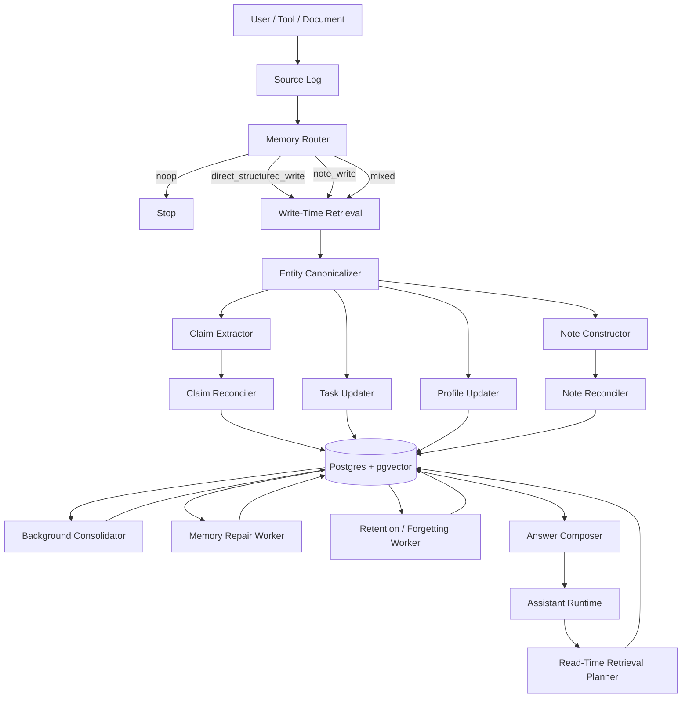

# 01. Architecture

## 1. Цель системы

Нужна memory layer для AI-агента, которая:

- переживает границы одной сессии
- умеет хранить факты, preferences, задачи, rationale и evolving plans
- поддерживает обновление знаний, а не только накопление
- позволяет объяснить, **откуда** взялась память
- не превращает каждый turn в permanent knowledge
- умеет старить, архивировать и чинить память

## 2. Центральная архитектурная идея

В `v3` у памяти четыре оси, а не одна:

1. **Representation**
   - `Source`
   - `Claim`
   - `Note`
   - `Profile`
   - `Task`
   - `Episode`

2. **Lifecycle**
   - write
   - reconcile
   - consolidate
   - repair
   - retain / archive / delete

3. **Retrieval policy**
   - `claim-first`
   - `note-first`
   - `mixed`
   - `evidence-first`
   - bounded budgets

4. **Scope and lineage**
   - `scope_json`
   - `scope_text`
   - source refs
   - origin note
   - memory runs

Без этих четырех осей память быстро превращается либо в transcript dump, либо в brittle fact store.

## 3. Основная модель записи

Теперь у системы два semantic path и два maintenance path.

### Semantic write paths

1. **Direct structured path**
   Для вещей, которые уже можно безопасно нормализовать:
   - explicit facts
   - stable preferences
   - commitments / tasks
   - clear status changes

2. **Note path**
   Для вещей, которые уже важны, но еще не должны становиться hard facts:
   - design direction
   - rationale / trade-offs
   - evolving plans
   - lessons / patterns
   - document digests
   - contextual framing

### Maintenance paths

1. **Consolidation**
   Переводит mature notes в claims / tasks / profile / episodes, если сигнал стал достаточно сильным.

2. **Repair**
   Чинит деградацию памяти:
   - duplicate clusters
   - stale items
   - contradictory active items
   - note spam
   - profile drift
   - bad merges

## 4. Рекомендуемая архитектура

## 5. Storage tiers

### Tier A. Core / in-context memory
Это маленькие блоки, которые почти всегда идут в prompt.

Что туда класть:
- краткий user profile
- active tasks
- очень короткий session summary
- system-level behavior preferences

Что туда не класть:
- все claims подряд
- все notes подряд
- raw transcript
- длинные списки фактов

### Tier B. Structured long-term memory
Основное typed memory-хранилище.

Типы:
- `Entity`
- `Claim`
- `Profile`
- `Task`
- `Episode`
- `Source`
- `MemoryRun`

### Tier C. Rich note memory
Промежуточный semantic layer:

- `Note`
- `NoteSource`
- `NoteEntity`
- `NoteLink`

Нужен для:
- design direction
- rationale
- local conclusions
- plan fragments
- document digests
- lessons

### Tier D. Raw evidence
Immutable или почти immutable слой:
- chat turns
- tool outputs
- imported records

### Tier E. Retrieval indexes
Даже если физически все сидит в одном Postgres:
- vector indexes на `sources`, `notes`, `claims`, `episodes`
- full-text indexes на `content_text`, `summary`, `normalized_text`
- filters по `namespace`, `entity`, `status`, `retrieval_state`, `time`, `type`

## 6. Structured scope

`v2` уже хорошо чувствовал важность scope, но `v3` делает это явным.

Нужно хранить одновременно:

- `scope_text`
  - человеческое объяснение границ
- `scope_json`
  - машинно-обрабатываемый envelope

Минимум в `scope_json`:
- `scope_kind`
- `project_id`
- `environment`
- `subject_entity_id`
- `conversation_id`
- `modality`
- `audience`

Почему это важно:
- reconciliation становится предсказуемее
- retrieval меньше переобобщает
- notes не конфликтуют ложно только потому, что обе “про базу”

## 7. Когда писать `Claim`, а когда `Note`

### Писать `Claim`
Когда информация:
- явная
- нормализуемая
- пригодна для точного ответа
- может быть сравнена с другими claims по predicate policy

Примеры:
- “отвечай мне на русском”
- “комментарии в коде должны быть на английском”
- “сейчас работаю с Python”
- “дедлайн в пятницу”

### Писать `Note`
Когда информация:
- уже важна
- полезна для будущего retrieval
- но слишком богата контекстом или слишком ранняя для hard fact

Примеры:
- “пока склоняемся к Postgres как source of truth”
- “Neo4j отложили, потому что нет traversal-heavy use case”
- “по памяти лучше разделять cheap router и сильный reconciler”
- “из документа следует, что стратегия еще обсуждается”

### Писать и то, и другое
Когда в одном материале есть:
- explicit facts / tasks
- плюс rationale / direction

## 8. Truth state и retrieval state

Это отдельные вещи, и их нельзя смешивать.

### Truth state
Отвечает на вопрос: актуально ли это как знание?

Для claims:
- `active`
- `superseded`
- `retracted`
- `expired`
- `candidate`

Для notes:
- `active`
- `superseded`
- `retracted`
- `resolved`
- `stale`
- `candidate`

### Retrieval state
Отвечает на вопрос: как это искать и держать в hot path?

Общий паттерн:
- `active`
- `warm`
- `cold`
- `archived`
- `deleted`

Пример:
- note может быть `resolved`, но еще `warm`, потому что полезен для rationale retrieval
- claim может быть `superseded`, но оставаться `warm` как historical evidence

## 9. Главная мысль: update не должен быть append-only

На записи у системы четыре обязательные задачи:

1. понять, стоит ли вообще писать память
2. найти похожие или конфликтующие items
3. превратить input в typed candidates
4. применить policy:
   - `insert`
   - `update`
   - `supersede`
   - `retract`
   - `noop`

Если пропустить retrieval/reconciliation, база быстро зарастает:
- дублями
- stale preferences
- conflicting notes
- task explosion
- summary spam

## 10. Разделение ответственности

### 10.1 User-facing runtime
Делает:
- диалог
- tool orchestration
- read-time retrieval
- cheap routing / escalation

Он не должен тащить на себе тяжелый reconciliation и repair.

### 10.2 Memory worker / manager
Делает:
- routing
- retrieval-before-update
- canonicalization
- note/claim extraction
- reconciliation
- consolidation
- repair
- retention

### 10.3 Storage layer
Отвечает за:
- immutable evidence
- typed tables
- transactional updates
- lineage
- indexes
- audit trail

## 11. Write path

### Step 1. Persist source
Сохраняем raw input:
- text
- source type
- speaker
- timestamp
- namespace
- thread/conversation ids
- optional embedding

### Step 2. Route
Router решает:
- `noop`
- `direct_structured_write`
- `note_write`
- `mixed`

### Step 3. Retrieve candidate memories
Перед extraction достаем:
- похожие claims
- похожие notes
- open tasks
- existing profile
- candidate entities / aliases
- recent evidence

### Step 4. Canonicalize entities
Привязать mentions к existing entities или создать новые.

### Step 5. Extract
Разные prompts для:
- claim extraction
- note construction
- task update
- profile update

### Step 6. Reconcile
Сравниваем candidate items с existing items.

### Step 7. Apply transaction
Одной транзакцией:
- upsert entities
- apply claim ops
- apply note ops
- apply task ops
- update profile projection
- store memory run log

### Step 8. Schedule maintenance
По debounce или cron:
- note consolidation
- duplicate merge
- stale cleanup
- profile repair
- alias merge
- retention / archive

## 12. Read path

### Step 1. Decide whether memory is needed
Memory search нужен, если вопрос:
- user-specific
- history-aware
- task-aware
- rationale-heavy
- temporal
- high-stakes

### Step 2. Load core blocks
Подтягиваем:
- short profile
- active tasks
- optional session summary

### Step 3. Choose retrieval mode

#### Claim-first
Для:
- factual questions
- preferences
- current status
- short “кто/что/когда”

#### Note-first
Для:
- “почему решили?”
- “к чему склонялись?”
- “что обсуждали?”
- “какой паттерн уже был?”

#### Mixed
Для:
- factual + rationale
- history + current state
- task with supporting discussion

#### Evidence-first / evidence-fallback
Для:
- конфликтов
- запросов на подтверждение / цитату
- высокой ставки

### Step 4. Respect retrieval budget
`v3` требует явных budget caps.

Рекомендуемый старт:

- `factual`
  - up to `6 claims`
  - up to `2 tasks`
  - up to `2 evidence snippets`

- `rationale`
  - up to `4 notes`
  - up to `2 claims`
  - up to `4 evidence snippets`

- `task`
  - up to `4 tasks`
  - up to `2 notes`
  - up to `2 evidence snippets`

- `mixed`
  - up to `4 claims`
  - up to `3 notes`
  - up to `2 tasks`
  - up to `3 evidence snippets`

### Step 5. Compose answer
Answer composer обязан:
- различать verified vs provisional
- учитывать conflicts
- уважать scope boundaries
- уметь abstain
- не выдавать note как hard fact без оговорки

## 13. Note maturity

Чтобы `Note` не превратился в summary-store, нужен lifecycle зрелости.

Полезный паттерн:
- `fresh`
- `stabilizing`
- `mature`
- `consolidated`

Что может повышать maturity:
- note использовался в retrieval
- note подтвержден несколькими sources
- note не конфликтует с новыми данными
- note пережил какое-то время без supersede
- note важен для recurring rationale questions

Что может понижать или закрывать note:
- явный supersede
- устаревший scope
- отсутствие использования
- слабая поддержка evidence

## 14. Memory repair

Repair — это отдельный background workflow.

Что он чинит:
- duplicate notes / claims
- contradictory active items
- profile drift
- stale task states
- bad entity merges
- note spam
- budget leakage в retrieval

Почему это надо выделять отдельно:
- consolidation делает память богаче
- repair делает память здоровее

Это разные работы.

## 15. Retention / forgetting

В `v3` forgetting — не случайное “пусть старое реже ищется”, а policy.

Минимальные действия:
- downgrade retrieval state
- archive
- soft delete
- hard delete by request

Минимальные триггеры:
- namespace policy
- age
- low use_count
- legal/privacy request
- explicit user forget/delete command

## 16. Optional fast/slow execution path

Это уже не обязательный MVP, но хороший следующий шаг.

### Fast path
- user-facing
- lower latency
- cheap retrieval
- cheap draft
- escalation gate

### Slow path
- stronger model / worker
- conflict resolution
- answer verification
- note consolidation
- memory repair

### Важный момент
Между fast и slow path лучше гонять **typed handoff objects**, а не свободный текст.

## 17. Почему не надо начинать с graph DB

`Entity + Claim + NoteLink + scope_json` уже дают graph-like semantics.
Для memory layer обычно хватает:

- Postgres
- JSONB
- pgvector
- full-text indexes
- lineage tables

Graph DB нужен, когда traversal/path queries становятся частью продукта, а не просто внутренним удобством.
