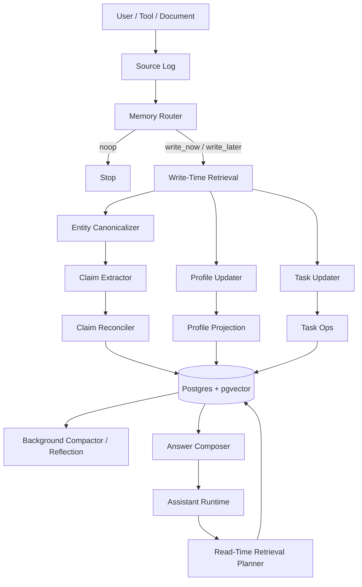

# 01. Architecture

## 1. Цель системы

Нужна memory layer для AI-агента, которая:

- переживает границы одной сессии
- умеет хранить факты, предпочтения, задачи и уроки
- поддерживает обновление знаний, а не только накопление
- позволяет объяснить, **почему** память выглядит именно так
- не превращает каждый чих в permanent knowledge

## 2. Рекомендуемая архитектура

## 3. Storage tiers

### Tier A. Core / in-context memory
Это маленькие блоки, которые попадают в prompt почти всегда.

Что туда класть:
- краткий user profile
- active tasks / commitments
- возможно, 3–7 строк session summary
- system-level behavior preferences

Что **не** класть:
- длинные списки фактов
- сырой transcript
- все прошлые разговоры
- все найденные claims

### Tier B. Structured long-term memory
Это основное typed memory-хранилище.

Минимальные типы:
- `Entity`
- `Claim`
- `Profile`
- `Task`
- `Episode` (можно со второй фазы)
- `Source`
- `MemoryRun`

### Tier C. Raw evidence
Immutable или почти immutable слой:
- chat turns
- document chunks
- tool outputs
- imported notes

Этот слой нужен, чтобы:
- объяснять происхождение знания
- перепроверять спорные обновления
- иметь retrieval не только по structured memory, но и по evidence

### Tier D. Retrieval indexes
Отдельный logical слой, даже если физически он сидит в том же Postgres:
- vector indexes на `sources`, `claims`, `episodes`
- full-text index на `normalized_text`
- фильтры по `namespace`, `entity`, `predicate`, `time`

## 4. Главная мысль: memory update не должен быть append-only

На записи у системы четыре задачи:

1. понять, стоит ли вообще писать память
2. найти похожие или конфликтующие memory items
3. превратить новые turns в typed candidates
4. применить update policy: `insert`, `update`, `supersede`, `retract`, `noop`

Если пропустить шаг 2 или 4, база быстро зарастает:
- дублями
- взаимоисключающими фактами
- устаревшими предпочтениями
- бессмысленными “воспоминаниями”

## 5. Разделение ответственности

### 5.1 User-facing agent
Отвечает пользователю, вызывает search, иногда hot-path memory tool, но **не обязан** сам заниматься сложной memory maintenance логикой.

### 5.2 Memory worker
Отдельный контур. Делает:
- routing
- retrieval-before-update
- extraction
- reconciliation
- profile/task projection
- compaction

Это удобно по двум причинам:
- latency ответа не страдает
- промпты для памяти можно эволюционировать отдельно от основного agent prompt

### 5.3 Storage layer
Отвечает за:
- append-only источники
- typed tables
- transactional updates
- индексы и lineage

## 6. Write path

### Step 1. Persist source
Сохраняем raw source:
- текст
- speaker / source type
- timestamp
- thread/conversation ids
- namespace
- optional embedding

### Step 2. Route
Роутер решает:
- `noop`
- `write_now`
- `write_later`

Обычно:
- explicit “запомни” → `write_now`
- устойчивые предпочтения / новые факты / commitments → `write_now` или `write_later`
- small talk / filler → `noop`

### Step 3. Retrieve candidate memories
Перед extraction надо достать:
- похожие claims
- open tasks
- существующий profile
- candidate entities / aliases
- recent evidence

### Step 4. Extract
Разные prompts для разных memory classes:
- profile updater
- claim extractor
- task updater
- (опционально) episode extractor

### Step 5. Reconcile
Сравниваем candidate items с existing items.
Результаты:
- `insert`
- `update`
- `supersede`
- `retract`
- `noop`

### Step 6. Apply transaction
Одной транзакцией:
- upsert entities
- apply claim ops
- apply task ops
- update profile projection
- store run log

### Step 7. Schedule maintenance
По debounce или cron:
- duplicate merge
- stale claim cleanup
- profile compaction
- alias merge
- episode synthesis

## 7. Read path

### Step 1. Decide whether memory is needed
Если вопрос требует:
- user-specific knowledge
- history
- prior commitments
- project context
- time-aware updates

то memory search нужен.

### Step 2. Load core blocks
Всегда полезно подтягивать:
- short profile
- open tasks
- maybe session summary

### Step 3. Plan retrieval
Read-time planner решает:
- какие memory types нужны
- какие filters применить
- нужен ли time filter
- нужен ли raw evidence

### Step 4. Retrieve
Извлекаем:
- claims
- relevant tasks
- evidence snippets
- maybe episodes

### Step 5. Compose answer
Answer composer обязан:
- различать verified и uncertain
- учитывать conflicts
- уметь abstain, если evidence слабый

## 8. Почему `Profile` лучше делать проекцией

Если `Profile` — это просто editable blob без evidence, он быстро теряет доверие.
Лучше считать его **projection layer** над:
- explicit user instructions
- stable preference claims
- selected identity facts
- compact summary fields

Тогда:
- его легко пересобрать
- легче отлавливать drift
- можно объяснить, откуда взялась каждая настройка

## 9. Почему не надо сразу делать graph DB

Потому что для memory layer типичные операции — это:
- upsert
- versioning
- lineage
- temporal filtering
- search with metadata
- profile/task projections

Это отлично ложится в Postgres.

Graph DB нужен, когда становятся центральными:
- multi-hop traversals
- path queries
- graph algorithms
- impact analysis
- recommendation / dependency graphs

До этого момента удобнее хранить graph-shaped data в реляционке.

## 10. Event sourcing vs mutable state

Рекомендую гибрид:

### Immutable layer
- `sources`
- `memory_runs`

### Mutable but versioned layer
- `entities`
- `claims`
- `profiles`
- `tasks`
- `episodes`

Так проще:
- откатывать кривые memory updates
- сравнивать версии prompt'ов
- проводить eval и forensic debugging

## 11. Что логировать обязательно

На каждый memory run:
- `run_id`
- prompt version
- model id
- source ids
- retrieved candidate ids
- raw structured output
- applied operations
- latency
- token usage
- success / failure

Без этого очень тяжело чинить prompt quality.

## 12. Non-goals первого релиза

Не стоит сразу делать:
- universal ontology
- fully automatic ontology induction
- heavy KG reasoning
- lifelong episodic replay с raw reasoning traces
- complex rank fusion из десятка источников
- online self-editing prompt optimizer

## 13. Security / privacy

Минимум:
- `namespace_id` во всех таблицах
- logical tenant isolation
- redaction policy для особо чувствительных полей
- retention policy на raw evidence
- delete / forget workflow
- audit trail на mutation events

## 14. Рекомендуемый operational режим

### Synchronous (hot path)
Использовать только для:
- explicit “remember this”
- критичных profile/task updates
- очень коротких updates

### Background
Использовать для:
- обычного extraction
- compaction
- profile refresh
- episode generation
- conflict cleanup

Это обычно самый здоровый режим по cost/latency.
