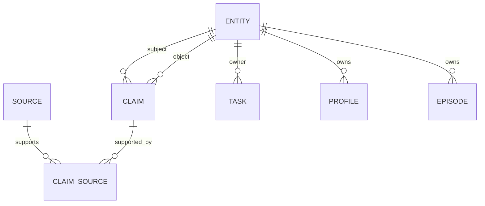
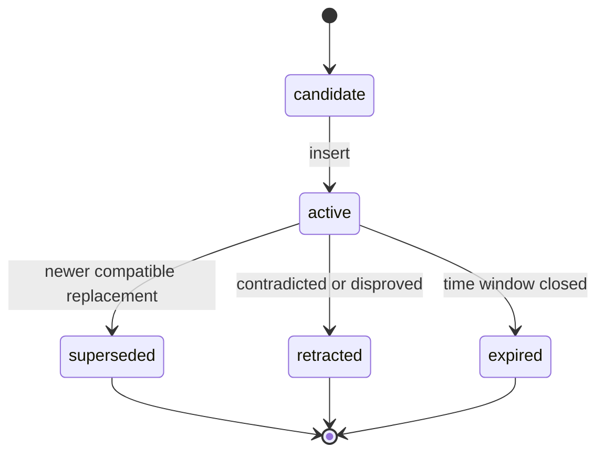

# 02. Data Model

## 1. Общая идея

Модель данных должна поддерживать одновременно четыре свойства:

- **typed memory**
- **lineage**
- **temporal truth**
- **reconcilable updates**

Поэтому я рекомендую разделить модель на:

- evidence layer
- graph-shaped semantic layer
- projections
- audit layer

## 2. Основные сущности

### 2.1 `Source`
Сырой источник знания.

Назначение:
- хранить chat turns, document chunks, tool outputs
- быть первичным evidence layer
- служить опорой для re-check и explainability

Рекомендуемые поля:
- `source_id: uuid`
- `namespace_id: uuid | text`
- `source_type: chat_turn | document_chunk | tool_output | imported_note`
- `conversation_id: text | null`
- `turn_id: text | null`
- `speaker_role: user | assistant | tool | system | external`
- `author_label: text | null`
- `content_text: text`
- `content_hash: text`
- `observed_at: timestamptz`
- `created_at: timestamptz`
- `metadata_json: jsonb`
- `embedding: vector | null`

Инварианты:
- источник не должен silently изменяться
- dedupe через `content_hash` полезен
- timestamps надо хранить отдельно от ingestion time

---

### 2.2 `Entity`
Канонический узел графа.

Назначение:
- объединять разные упоминания одного и того же объекта
- служить якорем для claims/tasks/episodes
- поддерживать aliases и merge

Рекомендуемые поля:
- `entity_id: uuid`
- `namespace_id`
- `entity_type: person | organization | project | repo | file | technology | product | location | concept | document | conversation`
- `canonical_name: text`
- `normalized_name: text`
- `summary: text | null`
- `status: active | merged | deleted`
- `merged_into_entity_id: uuid | null`
- `attributes_json: jsonb`
- `first_seen_at: timestamptz`
- `last_seen_at: timestamptz`
- `created_at: timestamptz`
- `updated_at: timestamptz`

Отдельная таблица `entity_aliases`:
- `alias_id`
- `entity_id`
- `alias_text`
- `alias_normalized`
- `source_id`
- `confidence`
- `created_at`

Инварианты:
- merge не удаляет историю
- alias всегда указывает на текущий canonical entity
- `normalized_name` индексируется

---

### 2.3 `PredicateCatalog`
Это не memory item, а конфиг для reconciliation.

Почему нужен:
- у разных предикатов разная cardinality
- у разных предикатов разная temporal semantics
- одни факты заменяются, другие сосуществуют
- часть фактов должна попадать в profile projection

Рекомендуемые поля:
- `predicate: text primary key`
- `description: text`
- `subject_type: text`
- `object_kind: entity | string | number | boolean | json`
- `cardinality: single | multi`
- `temporal_policy: atemporal | time_scoped | status_like`
- `conflict_policy: replace | coexist | range_split`
- `profile_sync: boolean`
- `task_sync: boolean`
- `default_importance: smallint`
- `active: boolean`

Примеры:

- `preferred_name`
  - cardinality: `single`
  - temporal_policy: `atemporal`
  - conflict_policy: `replace`
  - profile_sync: `true`

- `speaks_language`
  - cardinality: `multi`
  - temporal_policy: `atemporal`
  - conflict_policy: `coexist`

- `works_with`
  - cardinality: `multi`
  - temporal_policy: `status_like`
  - conflict_policy: `coexist`

- `prefers_response_language`
  - cardinality: `single`
  - temporal_policy: `status_like`
  - conflict_policy: `replace`
  - profile_sync: `true`

- `has_goal`
  - cardinality: `multi`
  - temporal_policy: `status_like`
  - conflict_policy: `coexist`

- `maintains_project_role`
  - cardinality: `multi`
  - temporal_policy: `time_scoped`
  - conflict_policy: `range_split`

---

### 2.4 `Claim`
Атомарный факт или relation edge.

Это ключевая таблица всей системы.

Рекомендуемые поля:
- `claim_id: uuid`
- `namespace_id`
- `subject_entity_id: uuid`
- `predicate: text`
- `object_entity_id: uuid | null`
- `object_value_json: jsonb | null`
- `normalized_text: text`
- `context_text: text | null`
- `qualifiers_json: jsonb`
- `confidence: numeric(4,3)`
- `importance: smallint`
- `status: active | superseded | retracted | expired | candidate`
- `valid_from: timestamptz | null`
- `valid_to: timestamptz | null`
- `first_seen_at: timestamptz`
- `last_seen_at: timestamptz`
- `supersedes_claim_id: uuid | null`
- `retracted_by_claim_id: uuid | null`
- `created_at: timestamptz`
- `updated_at: timestamptz`
- `embedding: vector | null`

`object_entity_id` и `object_value_json` — взаимоисключающие.
Один claim — один predicate application.

Примеры:
- `(user_1, prefers_response_language, "ru")`
- `(user_1, prefers_code_comment_language, "en")`
- `(user_1, works_with, technology_python)`
- `(user_1, likes, technology_kotlin)`
- `(user_1, has_goal, "design long-term memory for agent")`

Инварианты:
- один claim не должен содержать несколько логических утверждений
- claim должен быть понятен без исходного чата
- все relative time references должны быть нормализованы
- claim без evidence недопустим

---

### 2.5 `ClaimSource`
Связь claim ↔ evidence.

Рекомендуемые поля:
- `claim_id`
- `source_id`
- `support_type: direct | inferred | imported`
- `evidence_span: text | null`
- `evidence_quote: text | null`
- `support_confidence: numeric(4,3)`
- `created_at`

Назначение:
- объяснять происхождение facts
- поддерживать audit
- давать ground truth для re-check

Инварианты:
- каждый `active/superseded/retracted` claim должен иметь хотя бы одну запись в `claim_sources`
- если claim основан на inference, это должно быть явно отмечено

---

### 2.6 `Profile`
Компактная always-in-context проекция по пользователю/агенту.

Важно:
`Profile` не обязан быть единственным source of truth.
Это удобная проекция.

Рекомендуемые поля:
- `owner_entity_id: uuid`
- `namespace_id`
- `profile_json: jsonb`
- `profile_text: text`
- `version: bigint`
- `updated_from_run_id: uuid | null`
- `last_compacted_at: timestamptz | null`
- `created_at`
- `updated_at`

### Рекомендуемая структура `profile_json`

```json
{
  "preferred_name": null,
  "languages": [],
  "timezone": null,
  "communication": {
    "response_language": null,
    "detail_default": "short",
    "tone": "direct",
    "code_comment_language": "en"
  },
  "technical": {
    "primary_stack": [],
    "secondary_stack": [],
    "domains": []
  },
  "stable_preferences": [],
  "constraints": [],
  "current_focus": [],
  "soft_signals": []
}
```

Пояснение по полям:
- `stable_preferences` — то, что вероятно пригодится много раз
- `constraints` — инструкции, которые влияют на формат работы агента
- `current_focus` — активные, но не вечные темы
- `soft_signals` — слабые или частично inferred штуки

Инварианты:
- профиль должен быть коротким
- профиль не должен повторять весь `claims` store
- transient эмоции не должны попадать в профиль без отдельной причины

---

### 2.7 `Task`
Открытые обязательства и follow-ups.

Рекомендуемые поля:
- `task_id: uuid`
- `namespace_id`
- `owner_entity_id: uuid | null`
- `assignee_entity_id: uuid | null`
- `title: text`
- `description: text | null`
- `status: open | in_progress | blocked | done | cancelled`
- `priority: low | normal | high`
- `due_at: timestamptz | null`
- `acceptance_criteria_json: jsonb`
- `blockers_json: jsonb`
- `related_entity_ids_json: jsonb`
- `confidence: numeric(4,3)`
- `source_summary: text | null`
- `created_at`
- `updated_at`
- `closed_at: timestamptz | null`

Инварианты:
- request != commitment по умолчанию
- task должен требовать future action
- due dates хранятся в absolute form

---

### 2.8 `Episode`
Память про опыт и переносимые уроки.

Нужна не в MVP, но полезна во второй фазе.

Рекомендуемые поля:
- `episode_id: uuid`
- `namespace_id`
- `owner_entity_id: uuid | null`
- `situation: text`
- `action: text`
- `result: text`
- `lesson: text`
- `tags_json: jsonb`
- `success_score: numeric(4,3) | null`
- `source_refs_json: jsonb`
- `created_at`
- `updated_at`
- `embedding: vector | null`

Главное правило:
- хранить lesson и краткое описание, а не raw chain-of-thought

---

### 2.9 `MemoryRun`
Лог одного memory pipeline execution.

Рекомендуемые поля:
- `run_id: uuid`
- `namespace_id`
- `run_type: route | retrieve_update | canonicalize | extract_claims | reconcile_claims | update_profile | update_tasks | compact`
- `trigger_mode: hot_path | background | manual`
- `source_ids_json: jsonb`
- `prompt_name: text`
- `prompt_version: text`
- `model_name: text`
- `input_hash: text`
- `output_json: jsonb`
- `applied_ops_json: jsonb`
- `latency_ms: int`
- `token_input: int | null`
- `token_output: int | null`
- `status: success | failed | partial`
- `error_text: text | null`
- `created_at`

Это must-have для debugging и eval.

## 3. Relationship model

Минимальный граф выглядит так:



## 4. Claim lifecycle



### Как интерпретировать статусы
- `active` — актуален
- `superseded` — заменен более новым claim'ом той же области
- `retracted` — был признан неверным
- `expired` — был верен только в прошлом временном окне
- `candidate` — промежуточный статус до reconciliation

## 5. Правила атомарности claim'ов

Плохо:
- “Пользователь любит Kotlin, работает с Python и хочет короткие ответы”

Хорошо:
- `(user, likes, kotlin)`
- `(user, works_with, python)`
- `(user, prefers_answer_detail, short)`

Это очень влияет на качество update/retract logic.

## 6. Когда `object_entity_id`, а когда `object_value_json`

`object_entity_id` использовать, если объект:
- человек
- проект
- технология
- компания
- файл/репозиторий/документ
- место
- любой повторно-ссылаемый объект

`object_value_json` использовать, если объект:
- строка
- булево значение
- число
- datetime
- enum-like literal
- маленькая структура типа `{"unit":"hour","value":2}`

## 7. Qualifiers

`qualifiers_json` нужны для уточнений:
- scope: project, conversation, environment
- modality: explicit, inferred, observed
- channel: chat, email, imported doc
- certainty notes
- extra classification

Пример:
```json
{
  "scope_project": "agent_memory",
  "modality": "explicit",
  "channel": "chat",
  "language": "ru"
}
```

## 8. Materialized projections

### 8.1 `Profile` — projection
Формируется из:
- explicit user instructions
- stable preference claims
- identity claims
- lightweight summarization

### 8.2 Optional `search_documents` — projection
Можно делать unified retrieval layer:
- по claim normalized text
- по episode lesson
- по selected source chunks
- по task title/description

Но в MVP это не обязательно.

## 9. Suggested predicate starter set

Минимум я бы завел такой набор:

### Identity
- `preferred_name`
- `speaks_language`
- `timezone`
- `role_title`

### Communication
- `prefers_response_language`
- `prefers_answer_detail`
- `prefers_tone`
- `prefers_code_comment_language`

### Technical
- `works_with`
- `likes`
- `dislikes`
- `has_experience_with`
- `maintains_project_role`

### Goals and workflow
- `has_goal`
- `is_blocked_by`
- `uses_tool`
- `prefers_storage`
- `prefers_framework`

### Relationships
- `works_on_project`
- `collaborates_with`
- `owns_repo`
- `uses_database`

## 10. Что хранить в memory, а что не хранить

### Хранить
- устойчивые предпочтения
- повторно полезные факты
- долгоживущие ограничения
- commitments/tasks
- значимые changes of state
- переносимые lessons

### Не хранить
- greetings
- filler
- одноразовые фразы
- transient эмоции без последствий
- длинные объяснения, которые нельзя переиспользовать
- слабые догадки без evidence

## 11. Normalization rules

### Time normalization
Всегда:
- `сейчас` → absolute timestamp or open-ended validity
- `с завтрашнего дня` → explicit `valid_from`
- `раньше` → либо `valid_to`, либо contextual note

### Text normalization
`normalized_text` должен:
- быть standalone
- быть коротким
- не содержать местоимений без референта
- быть пригодным для retrieval

Плохо:
- “Он любит это”
Хорошо:
- “User prefers responses in Russian.”

## 12. Recommended joins for common queries

### Найти актуальные факты о пользователе
- `claims` where `subject_entity_id = user_id and status = active`

### Найти evidence для claim
- `claim_sources -> sources`

### Найти все открытые commitments
- `tasks` where `status in ('open', 'in_progress', 'blocked')`

### Найти похожие факты для reconciliation
- filters:
  - same namespace
  - same subject
  - same predicate
  - same or related object/entity
  - overlapping validity windows
  - vector similarity on `normalized_text`

## 13. Минимальные инварианты системы

1. У каждого claim есть evidence.
2. У каждого mutation есть `MemoryRun`.
3. Relative time не сохраняется как relative time.
4. Один claim — одно утверждение.
5. `Profile` всегда можно пересобрать.
6. `Source` не является тем же самым, что `Claim`.
7. `Entity` merge обратим хотя бы через audit trail.
