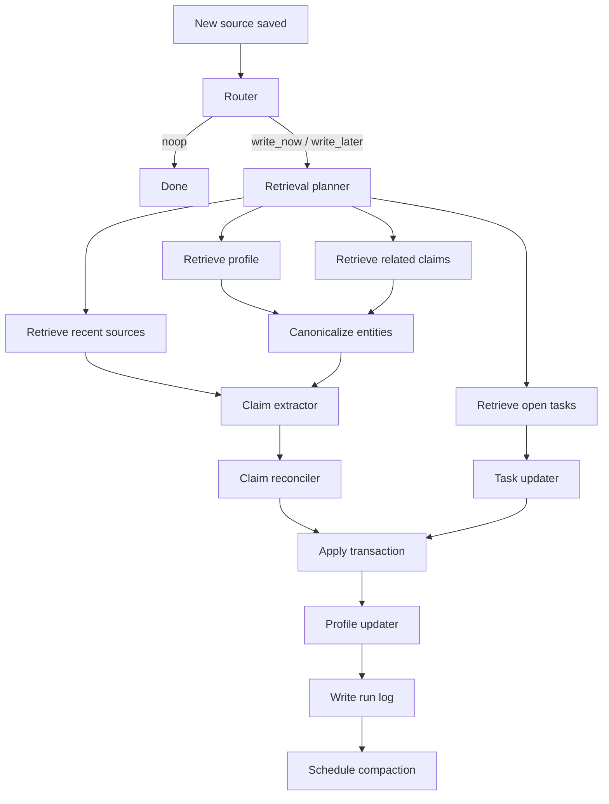
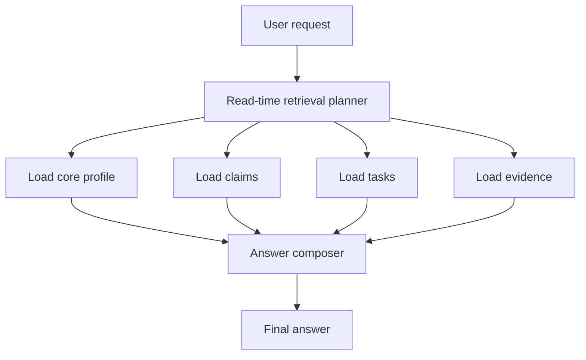

# 04. Workflows

## 1. Write path

Ниже — рекомендованный write workflow.



## 2. Detailed write workflow

### Step 1. Save source
Сначала сохраняется raw input:
- chat turn
- tool output
- imported document chunk

Это делается до любых LLM-операций.

### Step 2. Route
Router решает:
- не писать ничего
- писать сразу
- писать в фоне

### Step 3. Retrieve before update
До extraction достаем:
- current profile
- same-subject/same-predicate claims
- nearby semantic matches
- open tasks
- recent related sources

Это нужно, чтобы:
- не плодить дубли
- ловить conflicts
- уважать temporal history

### Step 4. Canonicalize entities
Собираем canonical ids для:
- user
- projects
- technologies
- repos/docs/organizations

### Step 5. Extract claims
Из последних turns вытаскиваются candidate claims.

### Step 6. Reconcile claims
На этом шаге решается:
- insert
- merge_duplicate
- supersede
- retract
- noop

### Step 7. Update tasks
Отдельный pipeline для commitments.

### Step 8. Refresh profile
Профиль обновляется последним, как projection.

### Step 9. Log run
Пишем `MemoryRun`, чтобы потом можно было дебажить.

### Step 10. Background cleanup
По debounce или cron:
- compaction
- alias merge
- stale cleanup
- episode synthesis

---

## 3. Read path



### Detailed read flow

#### Step 1. Decide whether memory matters
Если пользователь спрашивает:
- про свои предпочтения
- про то, что уже обсуждали
- про его проект/стек/историю
- про прошлые обязательства
- про изменение статуса во времени

то memory retrieval нужен.

#### Step 2. Always load core profile
Даже если deep retrieval не нужен, compact profile часто полезен для style alignment.

#### Step 3. Retrieve typed memory
Retrieve planner может выбрать:
- profile only
- profile + claims
- profile + tasks
- claims + evidence
- temporal search

#### Step 4. Compose answer with abstention
Если памяти не хватает, агент должен это признать, а не сочинять.

---

## 4. Debounced background processing

Обычно вредно запускать full memory extraction на каждое сообщение.
Лучше использовать debounce.

### Рекомендуемый паттерн
- на каждый новый source стартует/перезапускается таймер
- если в течение `N` секунд пришло еще сообщение, предыдущий background job отменяется
- memory update идет после “затишья”

### Практический смысл
- меньше redundant writes
- лучше контекст на extraction
- меньше cost
- меньше contradictory partial updates

---

## 5. Idempotency

Memory pipeline должен быть устойчив к повторному запуску.

### Как добиться
- считать `input_hash` по source ids + prompt version
- хранить applied ops
- не применять один и тот же op дважды
- использовать deterministic dedupe keys

### Good practice
`candidate_claim_hash = hash(subject, predicate, object, scope, valid_from, valid_to)`

---

## 6. Transaction boundaries

### Что стоит делать в одной транзакции
- upsert entities
- apply claim ops
- apply task ops
- write claim_sources
- write memory_run
- update profile projection

### Что можно делать вне транзакции
- embeddings
- background compaction
- heavy episode generation
- analytics counters

---

## 7. Failure handling

### 7.1 Invalid JSON from model
Что делать:
1. validator feedback
2. one retry with error summary
3. mark run as failed/partial
4. do not write half-broken memory

### 7.2 Missing entity resolution
Что делать:
- claim can still use literal `object_value`
- unresolved mention can remain without new entity if precision is low

### 7.3 Conflicting prompts
Если разные prompts выдали несовместимые вещи:
- evidence-backed typed items важнее prose summary
- profile должен строиться из reconciled claims, а не наоборот

### 7.4 Duplicate inserts
Лечится через:
- retrieval-before-update
- unique-ish hashes
- compaction job

---

## 8. Temporal updates

Это одно из самых больных мест memory systems.

### Rules
- `currently` → open interval from `valid_from` until superseded
- `used to` → previous claim gets `valid_to`
- `no longer` → either retract or close validity window
- explicit date ranges → store directly
- if date is ambiguous, keep `context_text` and avoid overprecision

### Example
“Сейчас работаю с Python, раньше больше писал на Kotlin.”

Можно представить как:
- active claim: `works_with Python`, `valid_from = now`
- older claim: `worked_with Kotlin`, `valid_to = now` or separate historical predicate

---

## 9. Conflict resolution policy

### Strong precedence order
1. explicit direct statement
2. explicit imported structured source
3. strong inference from repeated evidence
4. weak inference

### When to keep both
- different time windows
- different project scope
- different environment
- different assignee/owner role
- multi-valued predicate

### When to replace
- same single-valued preference
- same identity field
- same active status field

### When to retract
- clear contradiction or explicit correction
- disconfirmation by stronger evidence

---

## 10. Profile refresh policy

Не надо переписывать профиль после каждого чиха.

### Trigger profile refresh when
- communication preferences changed
- stable identity facts changed
- current focus significantly changed
- compactor marked drift
- enough new relevant claims accumulated

### Do not refresh profile when
- only raw evidence changed
- only low-confidence inference changed
- only duplicate claim_sources were added

---

## 11. Episode generation policy

Episodes — это phase 2.

### Good episode candidates
- повторяемая стратегия, которая сработала
- заметный failure mode
- lesson learned
- workflow pattern, который агент может переиспользовать

### Bad episode candidates
- обычные factual turns
- user preferences
- summaries without action/result/lesson
- raw reasoning traces

---

## 12. Suggested service decomposition

### API service
- receives user/tool/doc events
- writes `sources`
- exposes read endpoints
- maybe triggers hot-path tasks

### Memory worker
- runs router/extraction/reconciliation
- updates DB
- schedules compaction

### Retrieval service
- typed retrieval
- vector + lexical fusion
- time filtering
- candidate ranking

### Background maintenance worker
- compaction
- backfills embeddings
- profile refresh
- cleanup

---

## 13. Pseudocode

```python
def on_new_source(source):
    save_source(source)

    route = memory_router(source)
    if route["decision"] == "noop":
        return

    if route["decision"] == "write_later":
        enqueue_debounced_memory_job(source.namespace_id, source.conversation_id)
        return

    run_memory_update([source.source_id])


def run_memory_update(source_ids):
    batch = load_sources(source_ids)

    retrieval_plan = write_time_retrieval_planner(batch)
    candidates = retrieve_for_update(retrieval_plan)

    resolved_entities = entity_canonicalizer(batch, candidates["entities"])
    candidate_claims = claim_extractor(batch, resolved_entities)
    claim_ops = claim_reconciler(candidate_claims, candidates["claims"])

    task_ops = task_updater(batch, candidates["tasks"])
    profile_json = profile_updater(
        existing_profile=candidates["profile"],
        relevant_claims=apply_ops_preview(claim_ops),
        latest_turns=batch,
    )

    apply_memory_transaction(
        resolved_entities=resolved_entities,
        claim_ops=claim_ops,
        task_ops=task_ops,
        profile_json=profile_json,
        source_ids=source_ids,
    )

    schedule_compaction_if_needed()
```

---

## 14. Retrieval ranking strategy

Для update-time retrieval ranking я бы брал смесь:

- same subject / same predicate exact matches
- lexical overlap on `normalized_text`
- vector similarity
- recency
- temporal overlap
- importance
- last_used_at / use_count

### Why
Чистый embeddings search часто плохо ловит:
- single-valued conflicts
- temporal replacements
- structured duplicates

---

## 15. Observability

Что смотреть в проде:

### Write path
- fraction of routed `noop`
- write success rate
- invalid JSON rate
- average claims per memory run
- duplicate rate
- retraction/supersede rate
- profile size drift

### Read path
- memory retrieval latency
- memory hit rate
- abstention rate
- answer conflict rate
- stale answer rate

### Background
- compaction queue lag
- failed jobs
- average cluster size
- profile refresh frequency

---

## 16. Common failure modes and mitigations

### Over-extraction
Симптом:
слишком много мусорных claims

Лечение:
- tighten router
- strengthen claim extractor rules
- add importance threshold
- require evidence and predicate catalog match

### Under-extraction
Симптом:
полезные факты не попадают в память

Лечение:
- improve routing salience
- add better predicate starter set
- add background reprocessing

### Entity collapse
Симптом:
разные штуки склеились в одну entity

Лечение:
- stricter canonicalizer
- merge only on strong evidence
- audit + reverse merge path

### Temporal overwrite
Симптом:
новый факт убил историю

Лечение:
- `valid_from` / `valid_to`
- `range_split`
- better temporal instructions in reconciler

### Profile bloat
Симптом:
profile превратился в summary wall of text

Лечение:
- hard schema
- max list sizes
- compaction
- projection-from-claims policy

---

## 17. Recommended rollout

### Week 1–2
- sources + claims + profiles + tasks
- simple retrieval
- basic prompt pack
- manual inspection

### Week 3–4
- full reconciliation
- audit logs
- eval harness
- compaction

### Later
- episodes
- multi-tenant isolation hardening
- external docs ingestion
- graph read-model if needed
