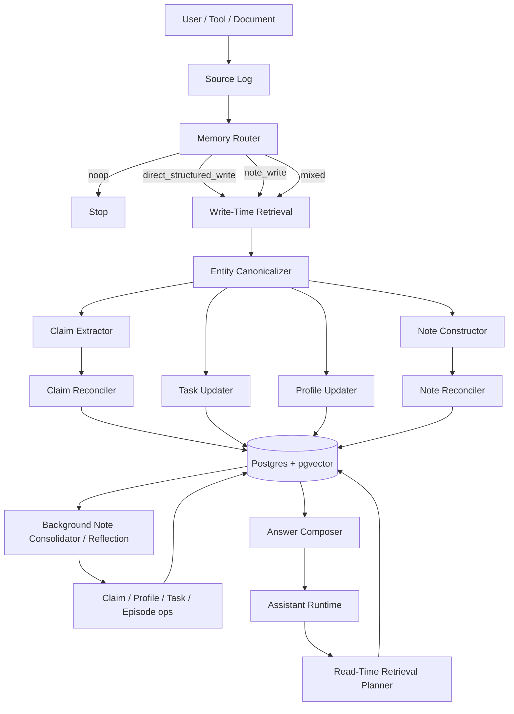

# 01. Architecture

## 1. Цель системы

Нужна memory layer для AI-агента, которая:

- переживает границы одной сессии
- умеет хранить факты, предпочтения, задачи, rationale и evolving plans
- поддерживает обновление знаний, а не только накопление
- позволяет объяснить, **откуда** взялась память
- не превращает каждый turn в permanent knowledge

## 2. Обновленная архитектурная идея

Теперь у системы два основных semantic path:

1. **Direct structured path**
   Для вещей, которые уже можно безопасно нормализовать:
   - explicit facts
   - stable preferences
   - open commitments / tasks

2. **Note path**
   Для вещей, которые уже важны, но еще не должны становиться hard facts:
   - design direction
   - rationale / trade-offs
   - evolving plans
   - lessons / patterns
   - digest длинного документа

`Note` — это не обязаловка на каждый write, а **дополнительный слой памяти**.

## 3. Рекомендуемая архитектура

## 4. Storage tiers

### Tier A. Core / in-context memory
Это маленькие блоки, которые попадают в prompt почти всегда.

Что туда класть:
- краткий user profile
- active tasks / commitments
- возможно, 3–7 строк session summary
- system-level behavior preferences

Что туда **не** класть:
- все claims подряд
- все notes подряд
- сырой transcript
- длинные списки фактов

### Tier B. Structured long-term memory
Основное typed memory-хранилище.

Типы:
- `Entity`
- `Claim`
- `Profile`
- `Task`
- `Episode` (со второй фазы)
- `Source`
- `MemoryRun`

### Tier C. Rich note memory
Полезный промежуточный semantic layer:

- `Note`
- `NoteSource`
- `NoteEntity`
- `NoteLink`

Этот слой нужен, чтобы хранить:
- design direction
- rationale
- plan fragments
- local conclusions
- document digests
- lessons

### Tier D. Raw evidence
Immutable или почти immutable слой:
- chat turns
- document chunks
- tool outputs
- imported records

### Tier E. Retrieval indexes
Даже если физически все сидит в одном Postgres:
- vector indexes на `sources`, `notes`, `claims`, `episodes`
- full-text indexes на `content_text`, `summary`, `normalized_text`
- filters по `namespace`, `entity`, `status`, `time`, `type`

## 5. Когда писать `Claim`, а когда `Note`

### Писать `Claim`
Когда информация:
- явная
- нормализуемая
- пригодна для точного ответа позже
- может быть сравнена с другими claims по conflict policy

Примеры:
- “отвечай мне на русском”
- “комментарии в коде должны быть на английском”
- “сейчас работаю с Python”
- “дедлайн в пятницу”

### Писать `Note`
Когда информация:
- уже важна
- полезна для будущего retrieval
- но слишком богата контекстом или слишком ранняя для hard fact

Примеры:
- “мы пока склоняемся к Postgres как source of truth”
- “Neo4j отложили, потому что пока нет traversal-heavy use case”
- “по памяти лучше разделять cheap router и сильный reconciler”
- “из документа следует, что текущая стратегия еще обсуждается”

### Писать и то, и другое
Когда в одном обсуждении есть:
- explicit facts/tasks
- плюс rationale / direction

Например:
- task: “сделать schema.sql”
- note: “пока берем Postgres + pgvector, потому что проще ops”

## 6. Главная мысль: update не должен быть append-only

На записи у системы четыре обязательные задачи:

1. понять, стоит ли вообще писать память
2. найти похожие или конфликтующие items
3. превратить новый input в typed candidates
4. применить policy: `insert`, `update`, `supersede`, `retract`, `noop`

Если пропустить retrieval/reconciliation, база быстро зарастает:
- дублями
- взаимоисключающими facts
- stale preferences
- conflicting notes
- бессмысленными summaries

## 7. Разделение ответственности

### 7.1 User-facing runtime
Делает:
- диалог
- простые tool calls
- read-time retrieval
- возможно hot-path write gating

Он **не должен** тащить на себе сложный reconciliation и consolidation.

### 7.2 Memory worker / manager
Делает:
- routing
- retrieval-before-update
- canonicalization
- note/claim extraction
- reconciliation
- profile/task projection
- background consolidation

### 7.3 Storage layer
Отвечает за:
- immutable evidence
- typed tables
- transactional updates
- lineage
- indexes
- audit trail

## 8. Write path

### Step 1. Persist source
Сохраняем raw input:
- text
- speaker / source type
- timestamp
- namespace
- thread/conversation ids
- optional embedding

### Step 2. Route
Роутер решает:
- `noop`
- `direct_structured_write`
- `note_write`
- `mixed`

Обычно:
- explicit “запомни”, preference, status change, deadline → direct structured
- design discussion, rationale, trade-offs, doc digest → note
- mixed dialogue → both

### Step 3. Retrieve candidate memories
Перед extraction надо достать:
- похожие claims
- похожие notes
- open tasks
- existing profile
- candidate entities / aliases
- recent evidence

### Step 4. Canonicalize entities
Привязать mentions к existing entities или создать новые.

### Step 5. Extract
Разные prompts для разных memory classes:
- claim extractor
- note constructor
- task updater
- profile updater

### Step 6. Reconcile
Сравниваем candidate items с existing items.

Возможные операции:
- `insert`
- `update`
- `supersede`
- `retract`
- `noop`

### Step 7. Apply transaction
Одной транзакцией:
- upsert entities
- apply claim ops
- apply note ops
- apply task ops
- update profile projection
- store memory run log

### Step 8. Schedule maintenance
По debounce или cron:
- duplicate merge
- stale note cleanup
- note -> claim/task/profile consolidation
- alias merge
- episode synthesis

## 9. Read path

### Step 1. Decide whether memory is needed
Memory search нужен, если вопрос требует:
- user-specific knowledge
- history
- prior commitments
- rationale
- project context
- time-aware updates

### Step 2. Load core blocks
Всегда полезно подтягивать:
- short profile
- open tasks
- maybe session summary

### Step 3. Choose retrieval mode

#### Claim-first
Используй для:
- factual questions
- preferences
- current status
- simple “кто/что/когда”

#### Note-first
Используй для:
- “почему решили?”
- “к чему склонялись?”
- “какая была суть обсуждения?”
- “какой паттерн уже обсуждали?”

#### Evidence-first / evidence-fallback
Используй для:
- спорных случаев
- конфликтов
- запросов на подтверждение / цитату
- высокой ставки

### Step 4. Compose answer
Answer composer обязан:
- различать verified vs provisional
- учитывать conflicts
- уметь abstain
- не выдавать note как hard fact без оговорки

## 10. Почему `Profile` лучше делать проекцией

Если `Profile` — просто editable blob без lineage, он быстро начинает drift'ить.
Лучше считать его projection layer над:
- explicit user instructions
- stable preference claims
- selected identity facts
- иногда над confirmed note consolidation

Тогда:
- его легче пересобрать
- легче ловить drift
- проще объяснить происхождение

## 11. Optional fast/slow execution path

Это уже не обязательный MVP, но хороший следующий шаг.

### Fast path
Небольшая/дешевая модель:
- отвечает пользователю
- делает read-time retrieval
- вызывает cheap router
- решает, нужно ли эскалировать

### Slow path
Более сильная/дорогая модель или worker:
- сложный reasoning
- conflict resolution
- note consolidation
- answer verification
- long-horizon planning

### Важный момент
Я бы не делал “два болтливых агента, которые спорят свободным текстом”.
Лучше, чтобы fast path отправлял slow path **typed handoff object**:

- `user_goal`
- `state_snapshot`
- `retrieval_pack`
- `uncertainty_flags`
- `required_outputs`

Это сильно проще дебажить и меньше рассинхрона.

## 12. Почему не надо начинать с graph DB

`Entity + Claim + NoteLink` уже дают графовую семантику.
Для memory layer обычно хватает:
- Postgres
- JSONB
- pgvector
- full-text indexes
- lineage tables

Graph DB имеет смысл, если traversal/path queries становятся частью продукта, а не просто внутренней моделью памяти.
