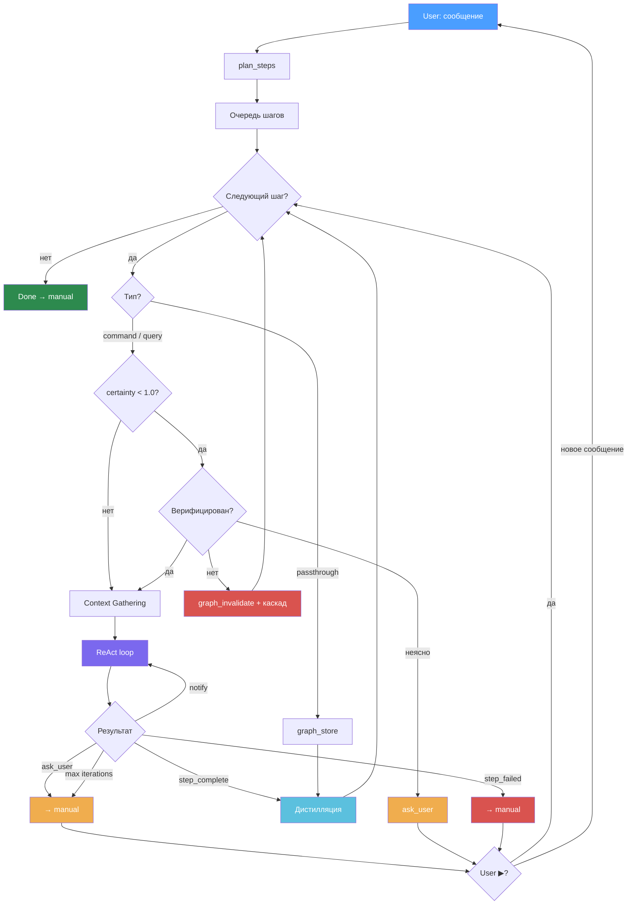

# Gromozeka Discourse Engine — Architecture

## Что это

Архитектура Discourse Engine для Gromozeka — системы, которая разбивает пользовательские сообщения на семантические шаги плана, выполняет их последовательно, и накапливает знания в графе.

**Шаг (Step, Discourse Unit)** — минимальный фрагмент текста, который можно обработать независимо. Один intent + контекст, необходимый для его выполнения.

**Pipeline:** сообщение → планирование (LLM) → план → context gathering → execution (ReAct) → дистилляция → следующий шаг.

**Трейдофф:** тратим больше токенов на execution (дорогой context gathering, несколько тернов ReAct), но экономим контекстное окно через дистилляцию — в треде остаётся компактный результат, а не развёрнутый процесс. Качество ответов выше за счёт полного сбора контекста, окно не забивается.

## Теоретическая база

### Таксономия шагов

Базовый скелет — **классификация речевых актов Searle (1975)**, 5 классов:

- **Assertives** — утверждения о мире
- **Directives** — побуждение к действию
- **Commissives** — обязательства говорящего
- **Expressives** — выражение отношения
- **Declarations** — изменение состояния мира самим высказыванием

Searle слишком грубый для executable плана (например "найди" и "подумай" оба Directives, но execution разный), поэтому Directives и Assertives расщеплены по принципу **разного execution behavior** с опорой на:

- **ISO 24617-2 (2020)** — Task dimension: Inform, Question, Request, Instruct, Offer, Promise, Accept, Decline. Используется как **справочник для типизации**, не как execution framework — routing определяется нашим принципом расщепления по execution behavior. [Bunt, 2020 — обзор стандарта](https://arxiv.org/abs/2006.12475)
- **DDA (Dependency Dialogue Acts, 2023)** — связь dialogue acts с риторическими отношениями. [Shi & Huang, 2023](https://aclanthology.org/2023.sigdial-1.31/)

### Execution model

- **ReAct** (Yao et al., 2023) — Reasoning + Acting. Агент думает, действует, наблюдает результат, повторяет. [arXiv:2210.03629](https://arxiv.org/abs/2210.03629)
- **Reflexion** (Shinn et al., 2023) — ReAct + рефлексия при неудаче. Upgrade path. [arXiv:2303.11366](https://arxiv.org/abs/2303.11366)
- **LATS** (Zhou et al., 2023) — MCTS + LLM. Для критически важных решений. [arXiv:2310.04406](https://arxiv.org/abs/2310.04406)
- **BDI** (Rao & Georgeff, 1995) — Belief-Desire-Intention. Маппинг типов шагов на слои агентной архитектуры

### Knowledge Graph

- **Leolani** (Baez Santamaria et al., VU Amsterdam) — episodic knowledge graph, graph patterns (novelty/conflict/gap/complement). Референс для Phase 2-3. [arXiv:2406.19500](https://arxiv.org/abs/2406.19500), [GitHub](https://github.com/leolani)
- **EMISSOR** — платформа для episodic KG. [arXiv:2105.08388](https://arxiv.org/abs/2105.08388)
- **Triple extraction** — извлечение триплетов из диалогов. [arXiv:2412.18364](https://arxiv.org/abs/2412.18364)
- **Кристаллизация** — после выполнения шаги превращаются в триплеты (subject → predicate → object) для долгосрочной памяти

## Формат шага

```json
{
  "id": 0,
  "text": "исходный фрагмент текста",
  "type": "command | query | inform | commit | correct | condition | evaluate",
  "certainty": 1.0,
  "entities": ["Entity1", "Entity2"],
  "depends_on": [],
  "meta": {}
}
```

- `type` — определяет что сказано, не что делать. Action selection — задача execution layer (ReAct loop)
- `certainty` — степень уверенности утверждения. 1.0 = факт, 0.5 = предположение, 0.0 = сомнение. Маркеры: "точно", "кажется", "может быть", "наверное", "я думаю"
- `depends_on` — ID шагов, от которых зависит этот (анафора, последовательность, основан на факте)
- `meta` — произвольные данные для конкретного типа (например `{"deadline": "завтра"}` для commit)
- `entities` — ключевые сущности, технологии, имена — для привязки к графу

## Типы шагов v1

Исходное сообщение для примеров:

> "Найди все TODO в проекте gromozeka, сгруппируй по приоритету. Кстати, вчерашний баг с хоткеем я пофиксил — проблема была в KeyEvent listener. И ещё подумай, может стоит перейти на Compose Desktop вместо Swing?"

Для сравнения — **token-level триплеты** (подход Leolani) из того же текста:

```
(user, find, TODO)
(TODO, located-in, project-gromozeka)
(user, fix, bug)
(bug, related-to, hotkey)
(problem, was-in, KeyEvent-listener)
(user, consider, Compose-Desktop)
(Compose-Desktop, instead-of, Swing)
```

Триплеты описывают факты о мире, шаги описывают что делать. Для executable плана нужны шаги на входе, триплеты — при кристаллизации в долгосрочную память.

### `command` — прямое указание выполнить действие

- **Searle:** Directive | **ISO 24617-2:** Instruct/Request
- **Из примера:** "Найди все TODO в проекте gromozeka, сгруппируй по приоритету"
- **Другие примеры:** "запусти тесты", "создай файл config.yaml", "удали эту ветку"

```json
{
  "id": 0,
  "text": "Найди все TODO в проекте gromozeka, сгруппируй по приоритету",
  "type": "command",
  "certainty": 1.0,
  "entities": ["TODO", "gromozeka"],
  "depends_on": []
}
```

### `query` — запрос информации или анализа

- **Searle:** Directive | **ISO 24617-2:** Question
- **Из примера:** "подумай, может стоит перейти на Compose Desktop вместо Swing"
- **Другие примеры:** "какой фреймворк лучше для UI?", "точно ли нам нужна эта переменная?"
- Вопрос — это вопрос, не побуждение к действию. "Точно ли нам нужна эта переменная?" требует ответа, а не удаления переменной.

```json
{
  "id": 2,
  "text": "подумай, может стоит перейти на Compose Desktop вместо Swing",
  "type": "query",
  "certainty": 1.0,
  "entities": ["Compose Desktop", "Swing"],
  "depends_on": []
}
```

### `inform` — сообщение факта, контекста

- **Searle:** Assertive | **ISO 24617-2:** Inform
- **Из примера:** "вчерашний баг с хоткеем я пофиксил — проблема была в KeyEvent listener"
- **Другие примеры:** "мы используем PostgreSQL 16", "деплой был вчера в 3 часа"

```json
{
  "id": 1,
  "text": "вчерашний баг с хоткеем я пофиксил — проблема была в KeyEvent listener",
  "type": "inform",
  "certainty": 1.0,
  "entities": ["hotkey-bug", "KeyEvent listener"],
  "depends_on": []
}
```

### `commit` — обязательство что-то сделать

- **Searle:** Commissive | **ISO 24617-2:** Promise/Offer
- **Пример:** "я пофикшу это завтра", "напишу тесты до пятницы", "займусь рефакторингом на неделе"

```json
{
  "id": 0,
  "text": "я пофикшу это завтра",
  "type": "commit",
  "certainty": 1.0,
  "entities": ["hotkey-bug"],
  "depends_on": [],
  "meta": {"deadline": "завтра"}
}
```

### `correct` — исправление ранее известного факта

- **Searle:** Assertive + Declaration | **ISO 24617-2:** —
- **Пример:** "нет, не Swing а AWT", "база не PostgreSQL, а MySQL", "это не баг, это фича"

```json
{
  "id": 0,
  "text": "нет, не Swing а AWT",
  "type": "correct",
  "certainty": 1.0,
  "entities": ["Swing", "AWT"],
  "depends_on": []
}
```

### `condition` — ограничение / условие для других шагов

- **Searle:** Assertive | **ISO 24617-2:** —
- **Пример:** "если проект на Kotlin...", "только для Linux", "при условии что API доступен"

```json
{
  "id": 0,
  "text": "если проект на Kotlin",
  "type": "condition",
  "certainty": 1.0,
  "entities": ["Kotlin"],
  "depends_on": [1]
}
```

### `evaluate` — оценка, мнение, отношение

- **Searle:** Expressive | **ISO 24617-2:** —
- **Пример:** "этот подход лучше", "Swing — сракота", "мне нравится как работает hotkey"

```json
{
  "id": 0,
  "text": "Swing — сракота",
  "type": "evaluate",
  "certainty": 0.8,
  "entities": ["Swing"],
  "depends_on": []
}
```

---

### Сводная таблица

| Тип | Searle | ISO 24617-2 | BDI layer |
|-----|--------|-------------|-----------|
| `command` | Directive | Instruct/Request | Intention |
| `query` | Directive | Question | Desire |
| `inform` | Assertive | Inform | Belief |
| `commit` | Commissive | Promise/Offer | Intention |
| `correct` | Assertive + Declaration | — | Belief update |
| `condition` | Assertive | — | Constraint |
| `evaluate` | Expressive | — | Desire |

## Workflow

### Stride Mode

**Stride Mode** — режим автономного выполнения плана. Приложение управляет flow, LLM выполняет шаги через tools. Пользователь может перехватить управление в любой момент.

Два состояния:

- **Stride** (`tool_choice: "any"`) — LLM обязана вернуть tool call, прямой текст запрещён
- **Manual** (`tool_choice: "auto"`) — обычный чат, LLM отвечает как хочет

### Диаграмма



### Сквозной flow

```
1. ПЛАНИРОВАНИЕ
   User → сообщение
   App → forced tool `plan_steps` → массив шагов с depends_on
   App → topological sort по depends_on → очередь выполнения
   App → stride mode ON

2. ВЫПОЛНЕНИЕ (цикл по шагам)
   App → пишет в чат "[STEP 1/N: type ...]"

   2a. Routing:
       command/query → полный ReAct (шаг 2b)
       inform/correct/evaluate/commit/condition → passthrough: graph_store → step_complete → шаг 3

   2b. ReAct execution:
       Context Gathering (принудительный):
         graph_query → что известно по entities?
         файлы/код → есть релевантное?
         web → нужно загуглить?
       ReAct loop:
         Thought → Action (bash/web/MCP/...) → Observation → Thought → ...
         → step_complete | step_failed | ask_user

3. ДИСТИЛЛЯЦИЯ
   App → заменяет блок [STEP_START...STEP_END] дистиллятом
   App → следующий шаг → goto 2

4. ЗАВЕРШЕНИЕ
   Все шаги done → manual mode
```

Чат и есть контекст — LLM видит дистилляты предыдущих шагов как часть истории.

### Routing по типу

**Полный ReAct** (agent loop с tools):
- `command` — выполнить задачу
- `query` — найти/проанализировать

**Passthrough** (сразу в граф, без agent loop):
- `inform` — сохранить факт
- `correct` — обновить существующий факт
- `evaluate` — сохранить оценку
- `commit` — сохранить с трекингом
- `condition` — привязать как constraint к зависимым шагам

**Толерантность к ошибкам типизации:** routing бинарный — ReAct vs passthrough. Перепутать inform/evaluate/commit между собой не критично (все passthrough). Перепутать command/query тоже ок (оба ReAct). Единственная критичная ошибка — command vs inform (сделать vs запомнить), но это самый очевидный для LLM кейс.

### ReAct execution

Action selection не зашита в шаг. Каждый `command`/`query` обрабатывается **ReAct agent loop** (Yao et al., 2023):

```
Шаг + собранный контекст
  → Thought: что нужно сделать?
    → Action: вызов tool
      → Observation: результат
        → Thought: достаточно? нужно ещё?
          → ... (повторять пока задача не решена)
            → step_complete
```

Один шаг может потребовать несколько тернов. Агент сам выбирает tools по контексту — `command: "найди TODO и сгруппируй"` это grep + parse + format, не один action.

**Termination conditions:** перед execution агент оценивает сложность шага и ставит max iterations (5-15). При достижении лимита — `ask_user`: "не получилось за N шагов, что делать?". Пользователь решает: продолжить, переформулировать, или отменить.

**Доступные backends:** Claude Code CLI (код, файлы, bash), LLM (рассуждение, анализ), Neo4j (граф), MCP tools (внешние интеграции).

**Альтернативы (upgrade path):**
- **Reflexion** (Shinn et al., 2023) — ReAct + рефлексия при неудаче. Добавить когда нужна self-correction
- **LATS** (Zhou et al., 2023) — MCTS + LLM. Для критически важных решений. Дорого по токенам

### Дистилляция

После завершения шага блок между маркерами `[STEP_START]...[STEP_END]` **заменяется** дистиллятом. Не суммаризация (сохраняет структуру процесса), а дистилляция (извлекает суть, процесс выбрасывает).

Дистиллят сохраняет:
- **Результат** — что получилось
- **Решения** — что выбрали и почему
- **Изменения в entities** — что обновилось в графе

Дистиллят выбрасывает:
- Промежуточные tool calls и их вывод
- Поисковые запросы и их результаты
- Черновики рассуждений

Это означает что **context gathering может быть дорогим** — лишний раз загуглить, проверить файлы, запросить KB — нормально. Токены потратятся на этапе выполнения, но после дистилляции останется только суть.

### Verification и инвалидация

Шаги с `certainty < 1.0` перед использованием как основы для зависимых шагов проходят **verification**:

```
certainty < 1.0 → собрать контекст (граф, поиск, код)
  → факт подтверждается?
    → да → certainty = 1.0, verified = true, продолжить
    → нет → инвалидировать шаг + каскад
    → неясно → ask_user
```

Шаги с `certainty = 1.0` считаются `verified` по умолчанию.

**Каскадная инвалидация:** если passthrough-шаг инвалидируется — вся цепочка зависимых тоже протухает.

```
inform("баг в KeyEvent listener")  ← инвалидирован: "нет, баг был в FocusManager"
  └── command("пофикси listener")  ← протух, основан на неверном факте
       └── query("проверь тесты")  ← протух
```

Семантика `depends_on`: не только "жди результат" (command → command), но и "основан на факте" (command → inform). Инвалидация propagates по всей цепочке.

### Переключение состояний

| Событие | → Состояние |
|---------|-------------|
| User отправил сообщение | `plan_steps` (forced) → stride |
| `step_complete` | App дистиллирует → следующий шаг (stride) |
| `step_failed` | → manual, показать ошибку |
| `ask_user` | → manual, показать вопрос |
| User прерывает (ввод посередине) | → manual |
| User нажал "продолжить" (▶) | → stride, следующий/текущий шаг |
| Все шаги выполнены | → manual |

### Tools

**Flow control:**
- `plan_steps` — разбить сообщение на шаги плана (forced, первый вызов)
- `step_complete` — шаг выполнен, результат + дистиллят
- `step_failed` — не получилось, причина
- `ask_user` — нужен ввод, переключает в manual
- `notify` — информационное сообщение, не останавливает stride

**Graph:**
- `graph_store` — сохранить passthrough шаг (inform/correct/evaluate/commit/condition)
- `graph_query` — запросить контекст по entities
- `graph_invalidate` — инвалидировать шаг + каскадная инвалидация

**Рабочие** (стандартные MCP tools):
- bash, read/write files, web search, и т.д.

## Промпты

### Архитектура промптов

```
System: [постоянный] роль агента (архитектор, разработчик, etc.)

User:
<тред целиком>
---
Последнее сообщение: <message>

---
<шпаргалка>  ← сменная, отрезается после вызова
```

Агент — доменный специалист. Шпаргалка — инструмент, который задаёт формат вывода. Разные шпаргалки = разные режимы одного агента.

### Шпаргалка: Планирование (Semantic Decomposition)

```
Разбей последнее сообщение на шаги плана.

Шаг — минимальный фрагмент с одним intent и необходимым контекстом.

Границы шагов:
  Явные — смена речевого акта, дискурсивные маркеры ("кстати", "а ещё", "но", "также"), смена топика/entity
  Неявные — смена адресата (ты делай → я сделал), смена временного фрейма (сейчас → вчера), смена модальности (факт → гипотеза)

Типы:
- command — прямое указание сделать
- query — запрос информации/анализа. Вопрос = вопрос, не побуждение к действию
- inform — факт, контекст
- commit — обязательство говорящего
- correct — исправление известного факта
- condition — ограничение для других шагов
- evaluate — оценка, мнение

Правила:
- Резолви анафоры из контекста треда ("его" → конкретный entity)
- Доменные термины резолви по контексту ("среда" = env, не день недели)
- depends_on — если шаг ссылается на другой или требует его результат
- entities — ключевые сущности, технологии, имена
- certainty — степень уверенности: 1.0 = факт, 0.5 = предположение, 0.0 = сомнение

Формат ответа — только JSON, без пояснений:
[
  {
    "id": 0,
    "text": "исходный фрагмент",
    "type": "тип",
    "certainty": 1.0,
    "entities": [],
    "depends_on": [],
    "meta": {}
  }
]

Примеры:

"Запусти тесты и скинь результат" →
[{"id":0,"text":"Запусти тесты и скинь результат","type":"command","certainty":1.0,"entities":["тесты"],"depends_on":[]}]

"Кажется проблема в кэше. Почисти его и проверь" →
[
  {"id":0,"text":"Кажется проблема в кэше","type":"inform","certainty":0.6,"entities":["кэш"],"depends_on":[]},
  {"id":1,"text":"Почисти его и проверь","type":"command","certainty":1.0,"entities":["кэш"],"depends_on":[0]}
]

"Мы вчера решили перейти на Gradle. Точно ли это лучше чем Maven для нашего случая?" →
[
  {"id":0,"text":"Мы вчера решили перейти на Gradle","type":"inform","certainty":1.0,"entities":["Gradle"],"depends_on":[]},
  {"id":1,"text":"Точно ли это лучше чем Maven для нашего случая?","type":"query","certainty":1.0,"entities":["Gradle","Maven"],"depends_on":[0]}
]
```

### Шпаргалка: Кристаллизация (Phase 2, DRAFT — наброски, не для имплементации)

```
⚠️ Черновик. Требует доработки перед реализацией.
Преобразуй выполненные шаги в триплеты для долгосрочной памяти.

Триплет: (subject, predicate, object) + perspective (polarity, certainty, sentiment)

Правила:
- Только факты, подтверждённые выполнением
- Предикаты — глаголы с предлогами (live-in, depend-on, written-in)
- Subject/object — конкретные entities, не местоимения
- При conflict с существующим триплетом — пометить оба

Формат ответа — только JSON:
[
  {
    "subject": {"text": "", "type": ""},
    "predicate": {"text": "", "type": ""},
    "object": {"text": "", "type": ""},
    "perspective": {"polarity": 1, "certainty": 1.0, "sentiment": 0},
    "source_step_id": 0
  }
]
```

## Как дополнять

### Принцип расщепления

Новый тип добавляется **только** когда существующий тип покрывает шаги с **разным execution behavior**. Если два шага одного типа обрабатываются одинаково — новый тип не нужен.

Алгоритм:
1. Встретился шаг, который не ложится ни в один тип
2. Определить ближайший существующий тип
3. Вопрос: шаг обрабатывается **иначе** чем другие шаги этого типа?
   - Да → расщепить тип, дать новому имя по execution behavior
   - Нет → оставить в существующем типе, различие несущественно

### Кандидаты на добавление (когда встретятся)

| Кандидат | Из какого типа | Когда нужен | Searle | ISO 24617-2 |
|----------|---------------|-------------|--------|-------------|
| `confirm` | inform | Если нужно различать "подтвердил" vs "сообщил новое" | Assertive | Accept |
| `reject` | evaluate | Если нужно различать "плохо" vs "отклоняю предложение" | Expressive | Decline |
| `clarify` | query | Если нужно различать "объясни" vs "найди" | Directive | Question (sub) |
| `delegate` | command | Если нужно различать "сделай сам" vs "попроси X сделать" | Directive | Request (sub) |
| `plan` | command | Если нужно различать "сделай сейчас" vs "составь план" | Directive | — |

### Справочник для сложных случаев

Когда не хватает своей таксономии — смотреть ISO 24617-2:
- **Task dimension** (56+ актов) — основной источник для расщепления Directives/Assertives
- **Discourse Structuring dimension** — если нужны мета-акты ("сменим тему", "вернёмся к...")
- **Feedback dimensions** — если нужно обрабатывать "понял" / "не понял"

Полный стандарт: ISO 24617-2:2020, краткое описание — Bunt (2020) "Annotation of Dialogue Acts in Multiparty Dialogue".

## Roadmap

### Phase 1 — Диалог и план (текущий фокус)

1. **Сообщение → шаги** — LLM structured extraction по таксономии выше
2. **Шаги → план** — узлы с depends_on, topological sort для execution order
3. **Execution** — каждый шаг обрабатывается ReAct agent loop (Thought → Action → Observation → ...)

Результат: работающий pipeline "написал сообщение → система разобрала → выполнила".

### Phase 2 — Кристаллизация (DRAFT)

4. **Шаги → триплеты** — после выполнения шаг превращается в долгосрочные факты (subject → predicate → object)
5. **Триплеты → Knowledge Graph** — entity обогащаются новыми связями, шаги удаляются

Результат: система накапливает знания между сессиями.

### Phase 3 — Reasoning, Leolani-style (DRAFT)

6. **Graph patterns** — при добавлении триплетов проверка на:
   - **Novelty** — новый факт → сохранить
   - **Conflict** — противоречие → создать `correct` или `query` шаг
   - **Gap** — неполный entity → создать `query` шаг
   - **Complement** — дополнение → обогатить
7. **Thoughts → новые шаги** — паттерны графа порождают новые DU, которые возвращаются в Phase 1

Результат: система сама замечает пробелы и противоречия в знаниях, задаёт вопросы, уточняет.

## Версионирование

- **v1** (текущая) — 7 типов, покрытие ~90% реальных сообщений (оценка)
- Расширять после тестирования на 20+ реальных сообщениях
- Каждое расширение документировать: какой шаг не лёг, почему расщепили, пример

---

## Implementation Notes (Architecture Decisions)

### Stride Mode Control

**UI:** Единственный переключатель "Strider on/off" в интерфейсе

**Storage:** Флаг `strideEnabled: Boolean` в Conversation entity (domain model)

**Behavior:**
- `strideEnabled = true` → каждое сообщение от пользователя автоматически проходит через `plan_steps` (forced tool call)
- `strideEnabled = false` → обычный чат без планирования

**Implementation:**
- Spring AI поддерживает forced tool choice через API
- Application layer: один `if` перед первым LLM call
- Если `strideEnabled && iterationCount == 0` → force `tool_choice = "plan_steps"`
- Дальше всё работает в обычном while loop (до 200 итераций)
- LLM сам управляет execution через tool calls
- Пользователь может изменить флаг из UI в любой момент

**Ключевой принцип:**
> Никакого отдельного orchestrator framework не нужно — вся сложность в промптах и tools, не в control flow. Приложение просто крутит while loop и переключает tool_choice.

### Plan and Step Persistence

**Storage:** Neo4j graph database (отдельно от Messages в SQL)

**Entities:**

```kotlin
Plan {
  id: UUIDv7,
  conversationId: String,  // property, not relationship
  status: EXECUTING | COMPLETED | FAILED | CANCELLED,
  createdAt: Instant,
  completedAt: Instant?
}

Step {
  id: UUIDv7,
  planId: String,
  text: String,
  type: StepType,
  certainty: Float,
  entities: List<String>,
  meta: JsonElement,
  position: Int,
  status: PENDING | EXECUTING | COMPLETED | FAILED | INVALIDATED,
  result: String?,
  createdAt: Instant,
  completedAt: Instant?
}
```

**Relationships:**
```cypher
(Plan)-[:HAS_STEP]->(Step)
(Step)-[:DEPENDS_ON]->(Step)
```

**Rationale:**
- План и шаги — execution artifacts, не persistent conversation history
- Граф хорошо подходит для dependency tracking и invalidation cascades
- Conversation остаётся в SQL, связь через property (не дублируем в Neo4j)

### Distillation

**Implementation:** Используем существующий механизм SquashOperation

**Workflow:**
1. Шаг выполняется → создаёт Messages (tool calls, results, thinking)
2. Шаг завершается → SquashOperation сжимает execution Messages
3. Новый Thread содержит только дистиллят
4. Оригинальные Messages сохраняются (immutable audit trail)

**SquashOperation.meta extension:**
```json
{
  "stepId": "step-uuid",
  "distillationType": "discourse_step"
}
```

### Cascading Invalidation

**Decision:** Не автоматически, через user confirmation

**Workflow:**
1. Step инвалидируется (verification failed, certainty < 1.0)
2. Система находит зависимые шаги через граф: `MATCH (s:Step)-[:DEPENDS_ON*]->(invalidated)`
3. Помечает зависимые как `INVALIDATED`
4. Вызывает `ask_user` tool с отчётом об инвалидации
5. Пользователь решает: продолжить | пересоздать план | отменить

**Rationale:**
- Сохраняет контроль у пользователя
- Предотвращает runaway cascades
- Явная точка принятия решения в UI

### Flow Control Tools

**Definition:** Как обычные domain specs (`:domain/tool/`)

**Tools:**
- `plan_steps` — разбить сообщение на шаги
- `step_complete` — шаг выполнен, результат
- `step_failed` — не получилось, причина
- `ask_user` — нужен ввод пользователя
- `notify` — информационное сообщение

**Implementation:** Infrastructure-ai реализует через Spring AI + MCP

### Phase 2 (Crystallization) Status

**Status:** НЕ реализуется в v1

**Rationale:**
- Фокус на execution workflow (Phase 1)
- Кристаллизация в триплеты — отдельная фаза после стабилизации
- Текущий механизм `add_memory_link` достаточен для ручного сохранения знаний

### Step Type Taxonomy

**Current:** 7 типов (command, query, inform, commit, correct, condition, evaluate)

**Routing:** Бинарный (ReAct vs passthrough)

**Rationale:** Типы — задел на будущее для более сложного execution behavior

**Note:** Толерантность к ошибкам типизации — перепутать inform/evaluate/commit не критично (все passthrough)