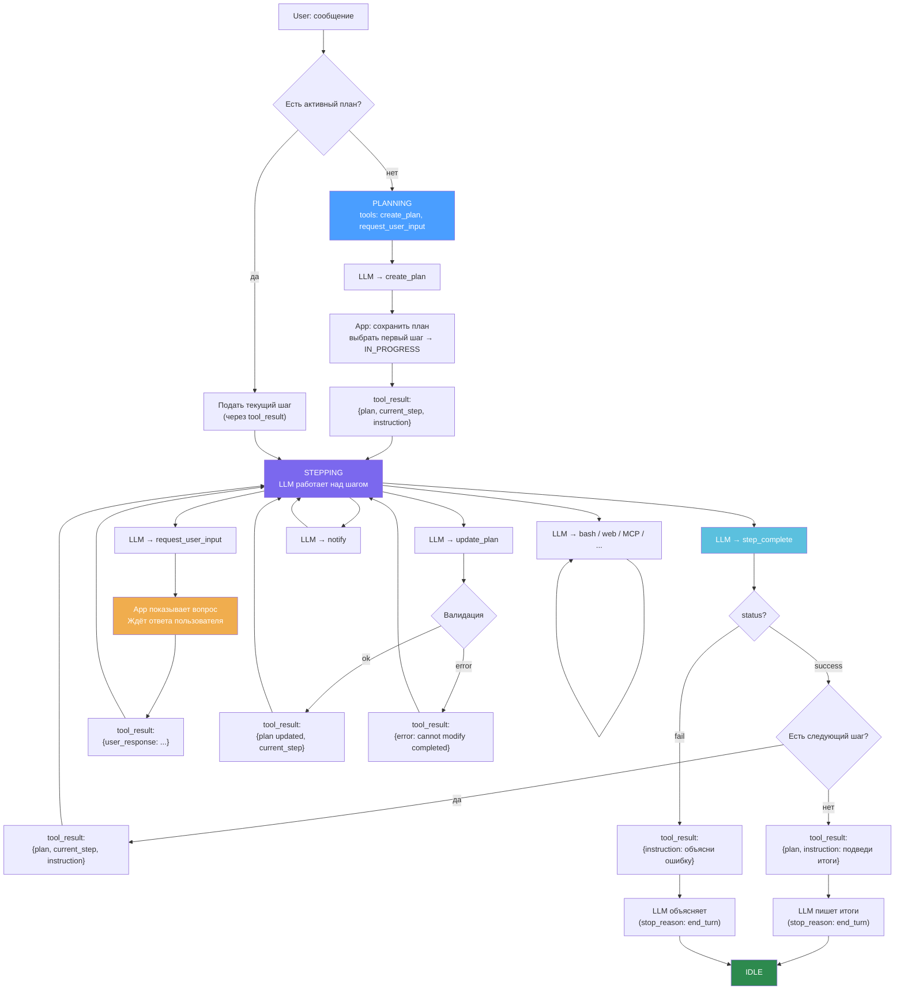

# Gromozeka Discourse Engine — Architecture

## Что это

Архитектура Discourse Engine для Gromozeka — системы, которая разбивает пользовательские сообщения на семантические шаги плана, выполняет их последовательно, и накапливает знания в графе.

**Шаг (Step, Discourse Unit)** — минимальный фрагмент текста, который можно обработать независимо. Один intent + контекст, необходимый для его выполнения.

**Pipeline:** сообщение → create_plan (LLM) → цикл выполнения шагов (LLM + tools) → step_complete → следующий шаг → итоги.

## Теоретическая база

### Таксономия шагов

Базовый скелет — **классификация речевых актов Searle (1975)**, 5 классов:

- **Assertives** — утверждения о мире
- **Directives** — побуждение к действию
- **Commissives** — обязательства говорящего
- **Expressives** — выражение отношения
- **Declarations** — изменение состояния мира самим высказыванием

Searle слишком грубый для executable плана (например "найди" и "подумай" оба Directives, но execution разный), поэтому Directives и Assertives расщеплены по принципу **разного execution behavior** с опорой на:

- **ISO 24617-2 (2020)** — Task dimension: Inform, Question, Request, Instruct, Offer, Promise, Accept, Decline. Используется как **справочник для типизации**, не как execution framework — routing определяется нашим принципом расщепления по execution behavior. [Bunt, 2020 — обзор стандарта](https://arxiv.org/abs/2006.12475)
- **DDA (Dependency Dialogue Acts, 2023)** — связь dialogue acts с риторическими отношениями. [Shi & Huang, 2023](https://aclanthology.org/2023.sigdial-1.31/)

### Knowledge Graph

- **Leolani** (Baez Santamaria et al., VU Amsterdam) — episodic knowledge graph, graph patterns (novelty/conflict/gap/complement). Референс для Phase 2-3. [arXiv:2406.19500](https://arxiv.org/abs/2406.19500), [GitHub](https://github.com/leolani)
- **EMISSOR** — платформа для episodic KG. [arXiv:2105.08388](https://arxiv.org/abs/2105.08388)
- **Triple extraction** — извлечение триплетов из диалогов. [arXiv:2412.18364](https://arxiv.org/abs/2412.18364)
- **Кристаллизация** — после выполнения шаги превращаются в триплеты (subject → predicate → object) для долгосрочной памяти

## Формат шага

### Input (create_plan)

Формат передаваемый LLM при создании плана. App добавляет `id`, `status`, `result` при сохранении.

```json
{
  "text": "исходный фрагмент текста",
  "type": "command | query | inform | commit | correct | condition | evaluate",
  "certainty": 1.0,
  "entities": ["Entity1", "Entity2"],
  "depends_on": []
}
```

- `type` — определяет что сказано, не что делать. Как обрабатывать — определяет app через инструкцию к шагу
- `certainty` — степень уверенности утверждения. 1.0 = факт, 0.5 = предположение, 0.0 = сомнение. Маркеры: "точно", "кажется", "может быть", "наверное", "я думаю"
- `depends_on` — ID шагов, от которых зависит этот (анафора, последовательность, основан на факте)
- `entities` — ключевые сущности, технологии, имена — для привязки к графу

### Runtime (в tool_result)

Формат в tool_result от app. Добавлены поля управляемые приложением.

```json
{
  "id": 0,
  "text": "исходный фрагмент текста",
  "type": "command",
  "status": "PENDING | IN_PROGRESS | COMPLETED | FAILED",
  "result": "текст результата (null если не завершён)",
  "certainty": 1.0,
  "entities": ["Entity1", "Entity2"],
  "depends_on": []
}
```

- `id` — присваивается app при сохранении плана
- `status` — управляется app (PENDING → IN_PROGRESS → COMPLETED/FAILED)
- `result` — текст из step_complete, null до завершения

## Типы шагов v1

Исходное сообщение для примеров:

> "Найди все TODO в проекте gromozeka, сгруппируй по приоритету. Кстати, вчерашний баг с хоткеем я пофиксил — проблема была в KeyEvent listener. И ещё подумай, может стоит перейти на Compose Desktop вместо Swing?"

Для сравнения — **token-level триплеты** (подход Leolani) из того же текста:

```
(user, find, TODO)
(TODO, located-in, project-gromozeka)
(user, fix, bug)
(bug, related-to, hotkey)
(problem, was-in, KeyEvent-listener)
(user, consider, Compose-Desktop)
(Compose-Desktop, instead-of, Swing)
```

Триплеты описывают факты о мире, шаги описывают что делать. Для executable плана нужны шаги на входе, триплеты — при кристаллизации в долгосрочную память.

### `command` — прямое указание выполнить действие

- **Searle:** Directive | **ISO 24617-2:** Instruct/Request
- **Из примера:** "Найди все TODO в проекте gromozeka, сгруппируй по приоритету"
- **Другие примеры:** "запусти тесты", "создай файл config.yaml", "удали эту ветку"

```json
{
  "id": 0,
  "text": "Найди все TODO в проекте gromozeka, сгруппируй по приоритету",
  "type": "command",
  "certainty": 1.0,
  "entities": ["TODO", "gromozeka"],
  "depends_on": []
}
```

### `query` — запрос информации или анализа

- **Searle:** Directive | **ISO 24617-2:** Question
- **Из примера:** "подумай, может стоит перейти на Compose Desktop вместо Swing"
- **Другие примеры:** "какой фреймворк лучше для UI?", "точно ли нам нужна эта переменная?"
- Вопрос — это вопрос, не побуждение к действию. "Точно ли нам нужна эта переменная?" требует ответа, а не удаления переменной.

```json
{
  "id": 2,
  "text": "подумай, может стоит перейти на Compose Desktop вместо Swing",
  "type": "query",
  "certainty": 1.0,
  "entities": ["Compose Desktop", "Swing"],
  "depends_on": []
}
```

### `inform` — сообщение факта, контекста

- **Searle:** Assertive | **ISO 24617-2:** Inform
- **Из примера:** "вчерашний баг с хоткеем я пофиксил — проблема была в KeyEvent listener"
- **Другие примеры:** "мы используем PostgreSQL 16", "деплой был вчера в 3 часа"

```json
{
  "id": 1,
  "text": "вчерашний баг с хоткеем я пофиксил — проблема была в KeyEvent listener",
  "type": "inform",
  "certainty": 1.0,
  "entities": ["hotkey-bug", "KeyEvent listener"],
  "depends_on": []
}
```

### `commit` — обязательство что-то сделать

- **Searle:** Commissive | **ISO 24617-2:** Promise/Offer
- **Пример:** "я пофикшу это завтра", "напишу тесты до пятницы", "займусь рефакторингом на неделе"

```json
{
  "id": 0,
  "text": "я пофикшу это завтра",
  "type": "commit",
  "certainty": 1.0,
  "entities": ["hotkey-bug"],
  "depends_on": []
}
```

### `correct` — исправление ранее известного факта

- **Searle:** Assertive + Declaration | **ISO 24617-2:** —
- **Пример:** "нет, не Swing а AWT", "база не PostgreSQL, а MySQL", "это не баг, это фича"

```json
{
  "id": 0,
  "text": "нет, не Swing а AWT",
  "type": "correct",
  "certainty": 1.0,
  "entities": ["Swing", "AWT"],
  "depends_on": []
}
```

### `condition` — ограничение / условие для других шагов

- **Searle:** Assertive | **ISO 24617-2:** —
- **Пример:** "если проект на Kotlin...", "только для Linux", "при условии что API доступен"

```json
{
  "id": 0,
  "text": "если проект на Kotlin",
  "type": "condition",
  "certainty": 1.0,
  "entities": ["Kotlin"],
  "depends_on": [1]
}
```

### `evaluate` — оценка, мнение, отношение

- **Searle:** Expressive | **ISO 24617-2:** —
- **Пример:** "этот подход лучше", "Swing — сракота", "мне нравится как работает hotkey"

```json
{
  "id": 0,
  "text": "Swing — сракота",
  "type": "evaluate",
  "certainty": 0.8,
  "entities": ["Swing"],
  "depends_on": []
}
```

---

### Сводная таблица

| Тип | Searle | ISO 24617-2 |
|-----|--------|-------------|
| `command` | Directive | Instruct/Request |
| `query` | Directive | Question |
| `inform` | Assertive | Inform |
| `commit` | Commissive | Promise/Offer |
| `correct` | Assertive + Declaration | — |
| `condition` | Assertive | — |
| `evaluate` | Expressive | — |

## Workflow

### Stride Mode

**Stride Mode** — режим автономного выполнения плана. App управляет flow через tool_result, LLM выполняет шаги через tools. Пользователь может прервать в любой момент (cancel HTTP запроса, кнопка отмены плана).

### State Machine

```
IDLE ──user msg──→ PLANNING ──create_plan──→ STEPPING ──все done──→ IDLE
                                               ↑    │    (итоги через tool_result)
                                               └────┘ step_complete(ok) + ещё шаги
                                                  │
                                         step_complete(fail) → IDLE
```

| Состояние | tool_choice | Tools |
|-----------|-------------|-------|
| IDLE | auto | всё (обычный чат) |
| PLANNING | any | `create_plan`, `request_user_input` |
| STEPPING | any | `step_complete`, `update_plan`, `request_user_input`, `notify`, рабочие MCP |

### Диаграмма



### Ключевой механизм: управление через tool_result

App управляет LLM не через отдельные сообщения, а через **tool_result**. Когда LLM вызывает create_plan, step_complete, или update_plan — app обязан вернуть tool_result. В этом ответе app передаёт обновлённый план + инструкцию для следующего шага.

Единый формат ответа от app:

```json
{
  "plan_id": "uuid",
  "steps": [
    {
      "id": 0, "text": "Найди все TODO...", "type": "command",
      "status": "COMPLETED", "result": "Нашёл 49 TODO...",
      "certainty": 1.0, "entities": ["TODO", "gromozeka"], "depends_on": []
    },
    {
      "id": 1, "text": "баг с хоткеем пофиксил...", "type": "inform",
      "status": "IN_PROGRESS", "result": null,
      "certainty": 1.0, "entities": ["hotkey-bug", "KeyEvent listener"], "depends_on": []
    },
    {
      "id": 2, "text": "стоит ли перейти на Compose Desktop...", "type": "query",
      "status": "PENDING", "result": null,
      "certainty": 1.0, "entities": ["Compose Desktop", "Swing"], "depends_on": []
    }
  ],
  "current_step_id": 1,
  "instruction": "Текущий шаг — [1] inform: '...'. Пользователь сообщает факт. Обработай: ..."
}
```

### Детальный flow

**Планирование:**
1. User отправляет сообщение
2. App проверяет: есть активный план? Нет → PLANNING
3. App вызывает LLM с `tool_choice: any`, tools: `[create_plan, request_user_input]`
4. LLM вызывает `create_plan({ steps: [...] })`
5. App сохраняет план в БД, выбирает первый шаг, помечает IN_PROGRESS
6. App возвращает tool_result: `{ plan, current_step_id, instruction }`
7. → STEPPING

**Выполнение (цикл):**
1. LLM получает tool_result с планом + текущий шаг + инструкция
2. LLM работает: вызывает tools (bash, web, MCP...) по необходимости
3. LLM вызывает `step_complete({ status: "success", result: "..." })`
4. App: шаг → COMPLETED, сохраняет result
5. App выбирает следующий шаг (первый PENDING с resolved depends_on)
6. Есть шаг → tool_result с новым шагом → goto 1
7. Нет шагов → tool_result с `instruction: "Подведи итоги"` → LLM пишет итоги → IDLE

**Ошибка:**
1. LLM вызывает `step_complete({ status: "fail", result: "причина" })`
2. App: шаг → FAILED, план → FAILED
3. App возвращает tool_result с `instruction: "Объясни пользователю причину"`
4. LLM пишет объяснение → IDLE

**Прерывание пользователем:**
1. User пишет сообщение пока LLM работает
2. App отменяет текущий HTTP запрос
3. Шаг остаётся IN_PROGRESS, план ACTIVE
4. User message добавляется в контекст
5. App вызывает LLM с обновлённым контекстом — план виден из предыдущих tool_result
6. LLM сама решает: продолжить шаг, update_plan, request_user_input, или step_complete

### Инструкции по типу шага

App формирует instruction в tool_result в зависимости от типа шага.

**Модификатор certainty** (добавляется к любому типу при `certainty < 1.0`):
> Уверенность в этом утверждении низкая ({certainty}). Собери дополнительный контекст, прими решение самостоятельно и запиши в результат. Не спрашивай пользователя — реши сам на основе доступной информации.

| Тип | Инструкция |
|-----|-----------|
| `command` | Выполни задачу: '{text}'. Собери контекст, используй tools, выполни. Завершай через step_complete. |
| `query` | Ответь на вопрос: '{text}'. Исследуй тему, собери информацию. Завершай через step_complete с развёрнутым ответом. |
| `inform` | Пользователь сообщает: '{text}'. Есть ли связанные проблемы или последствия? Нужно ли что-то обновить? Завершай через step_complete с выводами. |
| `correct` | Пользователь исправляет факт: '{text}'. Что зависело от старого факта? Что пересмотреть? Завершай через step_complete с анализом. |
| `evaluate` | Пользователь даёт оценку: '{text}'. Согласен ли ты? Аргументы за и против? Завершай через step_complete с анализом. |
| `commit` | Пользователь берёт обязательство: '{text}'. Зафиксируй. Есть ли зависимости или условия? Завершай через step_complete. |
| `condition` | Пользователь задаёт условие: '{text}'. Выполняется ли сейчас? Что зависит от него? Завершай через step_complete. |

### Выбор следующего шага

```
next = steps.filter(PENDING).filter(all depends_on are COMPLETED).first()
```

Если `null` и есть PENDING → deadlock (нерешённые зависимости) → step_complete(fail).

### Tools

#### create_plan

> Создаёт план выполнения. Разбей сообщение пользователя на шаги — каждый шаг это минимальный фрагмент с одним intent и необходимым контекстом.
>
> **Границы шагов:**
> Явные — смена речевого акта, дискурсивные маркеры ("кстати", "а ещё", "но", "также"), смена топика/entity.
> Неявные — смена адресата (ты делай → я сделал), смена временного фрейма (сейчас → вчера), смена модальности (факт → гипотеза).
> Не дроби если это одна задача ("найди и сгруппируй" = один шаг, не два).
>
> **Типы:** command (сделай), query (ответь/подумай), inform (факт), commit (обязательство), correct (исправление), condition (ограничение), evaluate (оценка).
>
> **Правила:**
> - Резолви анафоры из контекста треда ("его" → конкретный entity)
> - Доменные термины резолви по контексту ("среда" = env, не день недели)
> - depends_on — если шаг ссылается на другой или требует его результат
> - entities — ключевые сущности, технологии, имена
> - certainty — 1.0 = факт, 0.5 = предположение, 0.0 = сомнение. Маркеры: "точно", "кажется", "может быть"
> - Сохраняй оригинальный текст пользователя в поле text
>
> **Примеры:**
> "Запусти тесты и скинь результат" →
> [{"text":"Запусти тесты и скинь результат","type":"command","certainty":1.0,"entities":["тесты"],"depends_on":[]}]
>
> "Кажется проблема в кэше. Почисти его и проверь" →
> [{"text":"Кажется проблема в кэше","type":"inform","certainty":0.6,"entities":["кэш"],"depends_on":[]},
>  {"text":"Почисти кэш и проверь","type":"command","certainty":1.0,"entities":["кэш"],"depends_on":[0]}]

```json
// input
{ "steps": [
    { "text": "...", "type": "command|query|inform|commit|correct|condition|evaluate",
      "certainty": 1.0, "entities": [...], "depends_on": [] }
] }
// tool_result (формирует app)
{ "plan_id": "uuid", "steps": [...], "current_step_id": 0, "instruction": "..." }
```

#### update_plan

> Обновляет план. Можно менять текущий (IN_PROGRESS) и будущие (PENDING) шаги. Завершённые (COMPLETED) нельзя изменять.

```json
// input
{ "plan_id": "uuid", "steps": [...] }
// tool_result — success
{ "plan_id": "uuid", "steps": [...], "current_step_id": N, "instruction": "..." }
// tool_result — error
{ "ok": false, "error": "Cannot modify completed step 0" }
```

#### step_complete

> Завершает текущий шаг плана. Вызывай ТОЛЬКО после обработки всех результатов tools — результат шага должен учитывать все собранные данные. Нельзя вызывать параллельно с другими tools. Возвращает обновлённый план и следующий шаг.

```json
// input
{ "status": "success | fail", "result": "текст результата" }
// tool_result (формирует app)
{ "plan_id": "uuid", "steps": [...], "current_step_id": N | null, "instruction": "..." }
```

#### request_user_input

> Запрашивает информацию у пользователя. Используй когда не хватает данных, нужно подтверждение, или заблокирован. Не используй для обычных ответов.

```json
// input
{ "reason": "clarification | approval | missing_info | blocked",
  "question": "конкретный вопрос",
  "context": "зачем спрашиваю (опционально)" }
// tool_result (после ответа юзера)
{ "user_response": "текст ответа" }
```

#### notify

> Отправляет информационное уведомление пользователю. Не останавливает выполнение, не ожидает ответа.

```json
// input
{ "message": "Ищу TODO в исходниках..." }
// tool_result
{ "delivered": true }
```

### Статусы

**План:** ACTIVE | COMPLETED | FAILED | CANCELLED (кнопка UI)

**Шаг:** PENDING | IN_PROGRESS | COMPLETED | FAILED

Инвариант: максимум 1 шаг IN_PROGRESS в плане.

### Валидация update_plan

1. Загрузить текущий план из БД
2. COMPLETED шаги: сравнить с input — если изменены → error
3. IN_PROGRESS: можно менять
4. PENDING: можно менять, добавлять, удалять
5. Сохранить, вернуть обновлённый план

## Как дополнять

### Принцип расщепления

Новый тип добавляется **только** когда существующий тип покрывает шаги с **разным execution behavior**. Если два шага одного типа обрабатываются одинаково — новый тип не нужен.

Алгоритм:
1. Встретился шаг, который не ложится ни в один тип
2. Определить ближайший существующий тип
3. Вопрос: шаг обрабатывается **иначе** чем другие шаги этого типа?
   - Да → расщепить тип, дать новому имя по execution behavior
   - Нет → оставить в существующем типе, различие несущественно

### Кандидаты на добавление (когда встретятся)

| Кандидат | Из какого типа | Когда нужен | Searle | ISO 24617-2 |
|----------|---------------|-------------|--------|-------------|
| `confirm` | inform | Если нужно различать "подтвердил" vs "сообщил новое" | Assertive | Accept |
| `reject` | evaluate | Если нужно различать "плохо" vs "отклоняю предложение" | Expressive | Decline |
| `clarify` | query | Если нужно различать "объясни" vs "найди" | Directive | Question (sub) |
| `delegate` | command | Если нужно различать "сделай сам" vs "попроси X сделать" | Directive | Request (sub) |
| `plan` | command | Если нужно различать "сделай сейчас" vs "составь план" | Directive | — |

### Справочник для сложных случаев

Когда не хватает своей таксономии — смотреть ISO 24617-2:
- **Task dimension** (56+ актов) — основной источник для расщепления Directives/Assertives
- **Discourse Structuring dimension** — если нужны мета-акты ("сменим тему", "вернёмся к...")
- **Feedback dimensions** — если нужно обрабатывать "понял" / "не понял"

Полный стандарт: ISO 24617-2:2020, краткое описание — Bunt (2020) "Annotation of Dialogue Acts in Multiparty Dialogue".